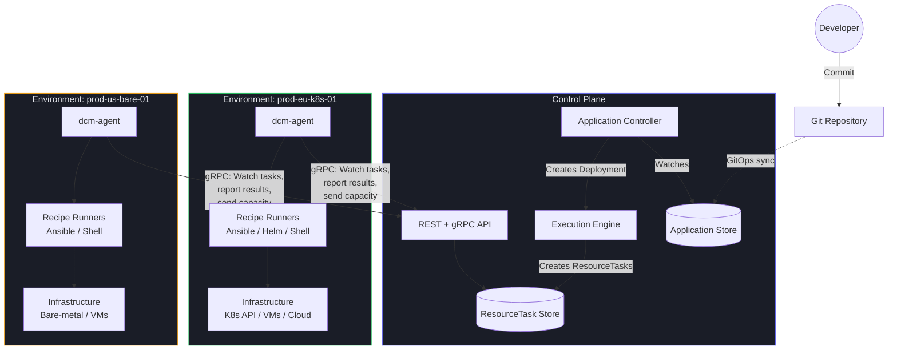
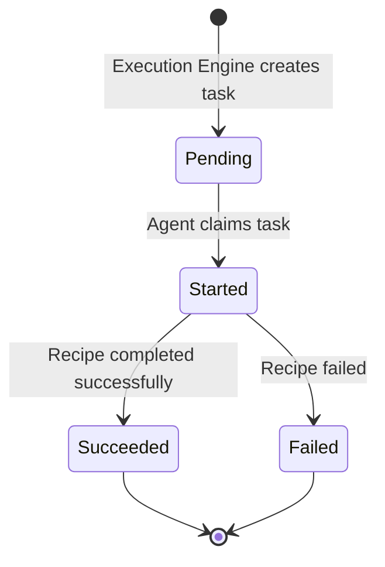

# DCM Environment Agent Design Document

**Status:** Draft
**Date:** 2026-05-28
**Authors:** DCM Team

---

## 1. Overview

This document presents an **alternative execution architecture** for DCM. The current design (see [architecture.md](architecture.md)) uses a centralized Execution Engine that invokes recipe drivers directly from the control plane. This document proposes a **distributed, agent-based model** where a `dcm-agent` binary runs in each environment, pulls work from the control plane, executes recipes locally, and reports results back.

Both architectures are valid. The centralized model is simpler to operate; the agent model is better suited for environments behind firewalls, air-gapped networks, or organizations that want to avoid centralizing credentials.

### 1.1 Problem Statement

The centralized Execution Engine has fundamental limitations in certain deployment scenarios:

- **Firewall/NAT traversal.** Many production environments (on-prem datacenters, air-gapped clusters, private cloud VPCs) do not allow inbound connections from an external control plane.
- **Credential sprawl.** The control plane accumulates credentials for every environment -- a single point of compromise.
- **Execution bottleneck.** All recipe execution funnels through the control plane, creating a scalability ceiling.
- **Network latency.** Recipes like Ansible playbooks and Helm installs run best when local to their targets.

### 1.2 Proposed Solution

Deploy a `dcm-agent` binary in each environment. The agent initiates an **outbound** gRPC connection to the control plane, watches for work assigned to its environment, executes recipes locally using environment-local credentials, and reports results back. This follows the same pattern used by Kubernetes kubelet, Nomad client agents, and ArgoCD agent mode.

### 1.3 Design Principles

1. **Agent pulls, never pushed to.** The agent initiates all connections. The control plane never connects inbound to an environment. This eliminates firewall and NAT issues.

2. **Control plane remains the source of truth.** All state (Deployments, ResourceTasks, results) lives in the control plane store. The agent is stateless -- it can be restarted without data loss.

3. **Recipe execution is local.** The agent runs recipes inside the environment, using local credentials and network access. The control plane never needs SSH keys, kubeconfigs, or cloud IAM credentials for managed environments.

4. **Graceful degradation.** If the control plane is unreachable, in-flight executions continue to completion. The agent queues status updates and retries when the connection is restored.

---

## 2. Agent Architecture

### 2.1 What the Agent Is

A single Go binary (`dcm-agent`) deployed as a long-running daemon in each environment. It:

- Connects to the DCM control plane via gRPC
- Identifies itself as representing a specific Environment
- Watches for ResourceTask resources assigned to its environment
- Executes recipes locally using built-in recipe runners
- Reports results, status, and capacity metrics back to the control plane
- Monitors resources it has deployed

### 2.2 Component Diagram



### 2.3 Lifecycle Phases

| Phase | Description |
|-------|-------------|
| **Register** | Agent starts, authenticates to the control plane, and registers itself for a named Environment. |
| **Watch** | Agent opens a gRPC Watch stream filtered to ResourceTasks assigned to its environment. |
| **Execute** | When a ResourceTask arrives, the agent fetches recipe artifacts, runs the recipe locally, and collects the result. |
| **Report** | Agent updates the ResourceTask status (phase, outputs, errors) via gRPC. |
| **Heartbeat** | Agent periodically sends capacity metrics and a heartbeat to the control plane. |
| **Reconnect** | On connection loss, the agent reconnects with exponential backoff. In-flight executions are not interrupted. |

### 2.4 Deployment Models

| Environment Type | Agent Deployment | Credentials |
|-----------------|-----------------|-------------|
| **Kubernetes** | Deployment or DaemonSet in a management namespace | ServiceAccount with cluster-admin or scoped RBAC |
| **Bare-metal / VMs** | systemd service on a management host | SSH keys to managed hosts |
| **Cloud (AWS/Azure/GCP)** | Container task (ECS, Cloud Run) or EC2/VM instance | IAM role / managed identity |

---

## 3. Communication Model

### 3.1 Protocol

gRPC over TLS. The agent is a gRPC **client** connecting outbound to the control plane's gRPC server. No inbound connections to the environment are required.

### 3.2 RPCs

| RPC | Direction | Type | Purpose |
|-----|-----------|------|---------|
| `Register` | Agent -> CP | Unary | Initial registration and authentication. |
| `WatchResourceTasks` | CP -> Agent | Server stream | Streams ResourceTask events for this environment (`phase == Pending`). |
| `UpdateTaskStatus` | Agent -> CP | Unary | Reports phase transitions with outputs. |
| `StreamTaskLogs` | Agent -> CP | Client stream | Streams execution logs line-by-line (optional). |
| `ReportCapacity` | Agent -> CP | Unary | Periodic capacity metrics (CPU, memory, storage, GPU). |
| `Heartbeat` | Agent -> CP | Unary | Keep-alive with agent version, uptime, active task count. |
| `GetRecipeArtifact` | Agent -> CP | Unary | Fetches recipe metadata and source location for a task. |

### 3.3 Message Flow

```
Agent                                    Control Plane
  |                                           |
  |--- Register(env, token) ----------------->|
  |<-- RegisterResponse(agentID, ok) ---------|
  |                                           |
  |--- WatchResourceTasks(env, sinceRev) ---->|
  |<-- ResourceTask(task-1, Pending) ---------|
  |                                           |
  |--- UpdateTaskStatus(task-1, Started) ---->|
  |--- StreamTaskLogs(task-1, line...) ------>|  (optional)
  |                                           |
  |    [agent executes recipe locally]        |
  |                                           |
  |--- UpdateTaskStatus(task-1, Succeeded, -->|
  |      result={values, secrets})            |
  |                                           |
  |--- ReportCapacity(cpu, mem, ...) -------->|
  |--- Heartbeat(version, uptime) ---------->|
  |                                           |
  |<-- ResourceTask(task-2, Pending) ---------|
  |    ...                                    |
```

### 3.4 Reconnection Behavior

1. On stream error: exponential backoff starting at 1s, capped at 60s, with jitter.
2. On reconnect: issue `ListResourceTasks(environment=<name>, phase=Pending)` to catch up on missed tasks, then re-open Watch stream from the latest revision.
3. In-flight recipe executions are **not** interrupted by connection loss. Results are queued locally and reported when the connection is restored.

### 3.5 Proto Definition

A separate gRPC service allows different authentication policies (agent tokens vs. user tokens):

```protobuf
service DCMAgentService {
  rpc Register(RegisterRequest) returns (RegisterResponse);
  rpc WatchResourceTasks(WatchResourceTasksRequest) returns (stream ResourceTaskEvent);
  rpc UpdateTaskStatus(UpdateTaskStatusRequest) returns (UpdateTaskStatusResponse);
  rpc StreamTaskLogs(stream TaskLogEntry) returns (StreamTaskLogsResponse);
  rpc ReportCapacity(ReportCapacityRequest) returns (ReportCapacityResponse);
  rpc Heartbeat(HeartbeatRequest) returns (HeartbeatResponse);
  rpc GetRecipeArtifact(GetRecipeArtifactRequest) returns (GetRecipeArtifactResponse);
}
```

---

## 4. Task Model -- ResourceTask

### 4.1 Why ResourceTask?

Deployments are coarse-grained (multi-resource, multi-environment). The agent needs fine-grained, per-resource, per-environment work items. The `ResourceTask` is an internal resource created by the Execution Engine when a Deployment enters the Provisioning phase. It represents a single resource provisioning action assigned to a specific environment.

### 4.2 Schema

```yaml
apiVersion: dcm.io/v1alpha1
kind: ResourceTask
metadata:
  name: my-web-app-rev-3-my-db
  labels:
    deployment: my-web-app-rev-3
    application: my-web-app
    resource: my-db
spec:
  deployment: my-web-app-rev-3
  resource: my-db
  resourceType: database.postgresql
  environment: prod-eu-k8s-01
  action: create
  properties:
    size: "M"
    version: "16"
    storageGB: 100
  context:
    resource:
      name: my-db
    application:
      name: my-web-app
    environment:
      name: prod-eu-k8s-01
      type: kubernetes
  recipe:
    name: default
    type: ansible
    source:
      repository: "https://git.example.com/recipes/postgresql.git"
      playbook: "provision.yml"
      version: "v2.1.0"
    parameters:
      backup_retention_period: 7
      storage_encrypted: true
  dependencyOutputs:
    vpc:
      privateSubnetIds: ["subnet-abc", "subnet-def"]
status:
  phase: Pending
  startedAt: ""
  finishedAt: ""
  message: ""
  agentID: ""
  result:
    values: {}
    secrets: {}
```

### 4.3 Spec Field Reference

| Field | Required | Type | Description |
|-------|----------|------|-------------|
| `spec.deployment` | Yes | string | Name of the parent Deployment. |
| `spec.resource` | Yes | string | Resource name within the Application. |
| `spec.resourceType` | Yes | string | Resource type name (e.g., `database.postgresql`). |
| `spec.environment` | Yes | string | Target environment name. Agent filters on this field. |
| `spec.action` | Yes | string | Action to perform: `create`, `update`, `destroy`. |
| `spec.properties` | Yes | map | Merged property map (developer values over operator defaults). |
| `spec.context` | Yes | object | DCM context object injected into recipe invocation (see [resource-type.md](resource-type.md), Section 6). |
| `spec.recipe` | Yes | object | Recipe metadata: type, source location, operator parameters. |
| `spec.dependencyOutputs` | No | map | Resolved outputs from upstream resources (for CEL expression resolution). |

### 4.4 Status Field Reference

| Field | Type | Description |
|-------|------|-------------|
| `status.phase` | string | `Pending`, `Started`, `Succeeded`, `Failed`. |
| `status.startedAt` | string (RFC 3339) | When the agent began execution. |
| `status.finishedAt` | string (RFC 3339) | When execution completed. |
| `status.message` | string | Error message on failure, or progress text. |
| `status.agentID` | string | ID of the agent that claimed this task. |
| `status.result.values` | map | Non-sensitive outputs from the recipe. |
| `status.result.secrets` | map | Sensitive outputs from the recipe. |

### 4.5 Lifecycle



The Execution Engine watches ResourceTask status changes and updates the parent Deployment's per-resource phase accordingly. ResourceTask phases map directly to DeploymentResource phases defined in [deployment.md](deployment.md):

| ResourceTask Phase | DeploymentResource Phase |
|-------------------|-------------------------|
| `Pending` | `Pending` |
| `Started` | `Provisioning` |
| `Succeeded` | `Succeeded` |
| `Failed` | `Failed` |

---

## 5. Recipe Execution

When the agent receives a ResourceTask, it follows this flow:

1. Create a working directory: `{agent-data-dir}/tasks/{task-name}/`
2. Fetch recipe artifacts based on `spec.recipe.source`
3. Prepare the execution environment (variables, context, credentials)
4. Invoke the appropriate recipe runner
5. Collect the `result` object (values + secrets)
6. Report the result via `UpdateTaskStatus`
7. Clean up the working directory

### 5.1 Recipe Runners

#### Ansible (Recommended)

Ansible is the recommended default recipe runner for the agent model:

- **Runs locally on the agent**, SSHing into targets as needed -- no daemon on target hosts.
- **Playbooks are self-contained** and easy to distribute via Git repositories.
- **Built-in modules** for cloud APIs (AWS, Azure, GCP), network devices, bare-metal hosts, Kubernetes.
- **Variables map directly**: `spec.properties` become Ansible extra-vars, `spec.context` becomes the `dcm_context` variable.
- The existing Ansible recipe example in [resource-type.md](resource-type.md) Section 4.5 already follows the DCM result contract.

**Invocation:**

```bash
ansible-playbook provision.yml \
  -e @task-vars.json \           # spec.properties + spec.context
  -e @recipe-params.json         # spec.recipe.parameters (operator defaults)
```

**Result collection:** The playbook sets a `result` fact (via `set_fact`). The agent parses the final fact state from the Ansible callback output.

#### Helm

Natural for Kubernetes environments. The agent runs Helm commands directly against the cluster API.

| Action | Command |
|--------|---------|
| `create` | `helm install {name} {chart} --version {version} --values {merged-values}` |
| `update` | `helm upgrade {name} {chart} --version {version} --values {merged-values}` |
| `destroy` | `helm uninstall {name}` |

**Result collection:** The agent reads a result ConfigMap or Secret created by the chart (convention: `{release-name}-dcm-result`), or parses Helm release notes.

#### Shell

For simple tasks and glue scripts. The script must output a JSON result to stdout.

```bash
#!/bin/bash
# ... provisioning logic ...

# Output result as JSON to stdout
cat <<EOF
{
  "values": {"host": "10.0.1.5", "port": 5432},
  "secrets": {"password": "s3cret"}
}
EOF
```

#### Terraform

Supported but with caveats. Terraform requires persistent state, and the agent is stateless. **A remote state backend is required** (S3, GCS, Consul, Terraform Cloud). The recipe source must include backend configuration.

| Action | Command |
|--------|---------|
| `create` / `update` | `terraform init && terraform apply -auto-approve -var-file=task-vars.json` |
| `destroy` | `terraform init && terraform destroy -auto-approve -var-file=task-vars.json` |

**Result collection:** `terraform output -json result`

### 5.2 Runner Comparison

| Runner | Best For | Artifact Source | State Management | Recommendation |
|--------|----------|----------------|------------------|----------------|
| **Ansible** | Bare-metal, VMs, cloud APIs, network devices | Git clone | Stateless (idempotent playbooks) | Primary -- recommended for most environments |
| **Helm** | Kubernetes environments | Helm repo, OCI registry | Helm release tracking (in-cluster) | Natural choice for k8s |
| **Shell** | Simple tasks, glue scripts | Git clone, inline | Stateless | Lightweight option |
| **Terraform** | Cloud infrastructure | Registry, Git | Remote state backend required | Supported with constraints |

### 5.3 Artifact Fetching

| Source Type | Mechanism |
|-------------|-----------|
| Git repository | `git clone --depth 1 --branch <version> <url>` into task working directory |
| Helm repository | `helm pull <repo>/<chart> --version <version>` |
| OCI registry | `oras pull` or `helm pull oci://` |
| HTTP/HTTPS URL | Download and extract tarball |

The recipe source location is provided in `spec.recipe.source`. The agent fetches artifacts before execution and caches them (keyed by source + version) to avoid redundant downloads.

### 5.4 Execution Sandbox

- Each task gets an isolated working directory under `{agent-data-dir}/tasks/{task-name}/`.
- Environment variables are set from `spec.properties` and `spec.context`.
- Execution timeout is configurable per recipe type (default: 30 minutes).
- Working directory is cleaned up after the result is reported. A configurable retention period can keep directories for debugging.

---

## 6. Result Reporting

### 6.1 Result Contract

The agent reports results using the **same contract** as the centralized model, defined in [resource-type.md](resource-type.md) Section 4.3:

```yaml
result:
  values:
    host: "db-prod-01.example.com"
    port: 5432
    connectionString: "postgres://db-prod-01.example.com:5432/mydb"
  secrets:
    username: "admin"
    password: "s3cur3p4ss"
```

The control plane validates the result against the ResourceType schema, exactly as in the centralized model.

### 6.2 Status Update Sequence

| Step | Phase | Payload |
|------|-------|---------|
| 1. Task claimed | `Started` | `agentID`, `startedAt` |
| 2. Progress (optional) | `Started` | `message` with progress text (e.g., "Running task 3 of 7") |
| 3a. Success | `Succeeded` | `finishedAt`, `result.values`, `result.secrets` |
| 3b. Failure | `Failed` | `finishedAt`, `message` with error details |

### 6.3 Idempotency

`UpdateTaskStatus` is idempotent. If the agent reports `Succeeded` twice (e.g., after reconnection), the control plane accepts the first and ignores the duplicate using optimistic concurrency (revision check).

### 6.4 Log Streaming

The `StreamTaskLogs` RPC allows the agent to stream execution logs line-by-line to the control plane. This enables operators to view recipe output (e.g., Ansible task output, Helm install logs) in the DCM dashboard in real time.

If log streaming is not configured or the connection is lost, logs are buffered locally and uploaded as a batch on task completion.

---

## 7. Capacity and Health Reporting

The Environment Agent subsumes and extends the lightweight `dcm-agent` capacity reporter described in [environment.md](environment.md) Section 4.

### 7.1 Capacity Reporting

Same data model as environment.md:

```yaml
capacity:
  cpu:
    total: 2000
    allocated: 1200
    available: 800
    unit: cores
  memory:
    total: 8192
    allocated: 5120
    available: 3072
    unit: GiB
  storage:
    total: 100000
    allocated: 45000
    available: 55000
    unit: GiB
  gpu:
    total: 64
    allocated: 24
    available: 40
    unit: devices
```

- Sent via `ReportCapacity` RPC at configurable interval (default 30s).
- The control plane updates `status.capacity` and `status.lastReported` on the Environment resource.
- Staleness detection works unchanged (see environment.md Section 4.3).

### 7.2 Heartbeat

- Sent every 15s (configurable).
- Contains: agent version, uptime, number of active tasks.
- If no heartbeat is received within the `staleness` threshold, the Environment is marked `stale`.
- Stale environments are excluded from placement by policies that check `env.status.staleness == "fresh"`.

### 7.3 Resource Monitoring

After a resource is successfully provisioned, the agent can periodically check its health:

- **Kubernetes:** Watch the deployed resource status (Pod readiness, Deployment rollout, StatefulSet health).
- **VMs:** Check SSH connectivity or process health via an agent-based health check.
- **Cloud resources:** Poll cloud APIs for resource state (RDS instance status, EC2 instance state).

Status changes are reported back to the control plane as status updates on the Deployment resource. This provides a foundation for future drift detection.

---

## 8. Registration and Identity

### 8.1 Registration Flow

1. Agent starts with configuration: `--control-plane <grpc-address>`, `--environment <env-name>`, `--token <auth-token>`.
2. Agent calls `Register(environmentName, token)`.
3. Control plane validates:
   - The Environment resource exists.
   - The token is valid for this environment.
   - No other agent is currently registered for this environment.
4. Control plane returns `RegisterResponse(agentID, ok)` and updates the Environment status:
   ```yaml
   status:
     agent:
       connected: true
       agentID: "agent-a1b2c3"
       version: "0.5.0"
       connectedAt: "2026-05-28T08:00:00Z"
   ```
5. Agent proceeds to Watch phase.

### 8.2 Authentication Options

| Method | Description | Use Case |
|--------|-------------|----------|
| **Bearer token** | Pre-shared token stored in Environment resource (hashed, never returned in API responses). | Simple deployments, getting started. |
| **mTLS** | Agent presents a client certificate. Control plane validates against a CA. | Production deployments with PKI. |
| **OIDC/JWT** | Agent authenticates via an identity provider (AWS IAM, GCP Workload Identity). | Cloud-native deployments. |

### 8.3 One Agent per Environment

The initial design supports **one agent per environment**. If an agent disconnects and a new one registers for the same environment, the control plane accepts the new registration (previous agent is superseded). Multi-agent HA is a future consideration.

### 8.4 Environment Spec Additions

```yaml
apiVersion: dcm.io/v1alpha1
kind: Environment
metadata:
  name: prod-eu-k8s-01
spec:
  # ... existing fields (type, connection, capabilities, etc.) ...

  agent:
    reportInterval: "30s"
    staleness: "120s"
    recipeRunners:
      - ansible
      - helm
      - shell
```

| Field | Required | Default | Description |
|-------|----------|---------|-------------|
| `spec.agent` | No | -- | Agent configuration block. Presence indicates agent-based execution. |
| `spec.agent.reportInterval` | No | `30s` | How often the agent reports capacity metrics. |
| `spec.agent.staleness` | No | `120s` | Time after which the environment is marked stale if no heartbeat is received. |
| `spec.agent.recipeRunners` | No | `[ansible, helm, shell]` | Recipe runner types supported by this agent. |

---

## 9. Comparison with Centralized Model

| Aspect | Centralized Execution | Agent-Based Execution |
|--------|----------------------|----------------------|
| **Network direction** | Control plane connects outbound to environments | Agent connects outbound to control plane |
| **Firewall friendliness** | Requires inbound access to every environment | Only outbound from environment; no inbound rules needed |
| **Credentials** | Control plane holds credentials for all environments | Each agent holds only local credentials |
| **Execution locality** | Recipes run on control plane host | Recipes run inside the target environment |
| **Scalability** | Bottlenecked on control plane compute | Distributed across agents |
| **Latency** | Network round-trips between control plane and targets | Local execution, minimal latency |
| **Complexity** | Simpler -- single process | More components to deploy and manage |
| **Observability** | All logs in one place | Logs distributed; need streaming or aggregation |
| **Offline resilience** | Environments unreachable = stuck | Agent retries locally, queues results |
| **Recipe support** | All recipe types equally supported | Ansible and Helm are natural fits; Terraform needs remote state |
| **State management** | Control plane manages all state | Agent is stateless; state stays in control plane |
| **Security posture** | Central credential store (single point of compromise) | Credentials distributed and scoped per environment |

---

## 10. Example Flow

**Scenario:** Developer updates Application `my-web-app` to change database size from `S` to `M`. The database is in environment `prod-eu-k8s-01` which uses agent-based execution with an Ansible recipe.

```
 1. Developer commits updated Application YAML to Git.

 2. GitOps controller syncs the change to the Application store.

 3. Application Controller detects the update, creates Deployment my-web-app-rev-4.

 4. Execution Engine runs planning:
    - Validates Application against ResourceType schemas
    - Builds dependency DAG
    - Runs placement pipeline
    - Diffs against previous Deployment (rev-3):
        my-db:    Modified (size S -> M)  -> action=update
        my-cache: Unchanged              -> action=unchanged
        my-fe:    Unchanged              -> action=unchanged

 5. Execution Engine checks environment prod-eu-k8s-01:
    - spec.agent is set -> delegate to agent
    - Creates ResourceTask:

        name: my-web-app-rev-4-my-db
        spec:
          deployment: my-web-app-rev-4
          resource: my-db
          resourceType: database.postgresql
          environment: prod-eu-k8s-01
          action: update
          properties: {size: "M", version: "16", storageGB: 100}
          recipe:
            type: ansible
            source:
              repository: "https://git.example.com/recipes/postgresql.git"
              playbook: "provision.yml"
              version: "v2.1.0"

 6. Agent in prod-eu-k8s-01 receives ResourceTask via Watch stream.

 7. Agent fetches recipe:
    git clone --depth 1 --branch v2.1.0 \
      https://git.example.com/recipes/postgresql.git

 8. Agent executes:
    ansible-playbook provision.yml \
      -e '{"size":"M","version":"16","storageGB":100}' \
      -e '{"dcm_context":{"resource":{"name":"my-db"},...}}'

 9. Playbook provisions/updates PostgreSQL, sets result fact:
    result:
      values: {host: "db-prod-01.internal", port: 5432, connectionString: "..."}
      secrets: {username: "admin", password: "newpass123"}

10. Agent calls UpdateTaskStatus(task, Succeeded, result).

11. Control plane validates result against database.postgresql ResourceType schema.

12. Execution Engine watches ResourceTask, sees Succeeded.

13. Execution Engine updates Deployment my-web-app-rev-4:
    my-db:    phase=Succeeded, outputs stored
    my-cache: phase=Succeeded (carried from rev-3)
    my-fe:    phase=Succeeded (carried from rev-3)
    Deployment phase -> Succeeded
```

---

## 11. Glossary

| Term | Definition |
|------|------------|
| **dcm-agent** | A Go binary deployed per environment that connects to the control plane, executes recipes locally, and reports results and capacity. |
| **ResourceTask** | An internal resource representing a single resource provisioning action assigned to a specific environment. Created by the Execution Engine, consumed by the agent. |
| **Recipe Runner** | A component within the agent that knows how to execute a specific recipe type (Ansible, Helm, Shell, Terraform). |
| **Heartbeat** | A periodic keep-alive message from the agent to the control plane, used for staleness detection. |
| **Registration** | The process by which an agent authenticates and associates itself with a named Environment in the control plane. |

---

## 12. Future Considerations

These are out of scope for the current design but may be addressed later:

- **Agent HA.** Multiple agents per environment with task distribution via optimistic locking on `status.agentID`.
- **Agent auto-update.** Control plane pushes agent binary updates via the gRPC channel.
- **Agent plugins.** Extensible recipe runner interface allowing third-party runners loaded as plugins.
- **Drift detection.** Agent periodically re-runs recipes in plan/check mode (Ansible `--check`, Terraform `plan`) and reports drift.
- **Offline mode.** Agent caches task definitions locally, enabling execution during extended control plane outages.
- **Approval gates.** Control plane holds a ResourceTask in `PendingApproval` phase, requiring human approval before the agent executes.
- **Resource garbage collection.** Agent detects orphaned resources (provisioned but no longer tracked by any Deployment) and reports them for cleanup.
- **Bidirectional streaming.** Replace unary RPCs with bidirectional streaming for more efficient communication.
