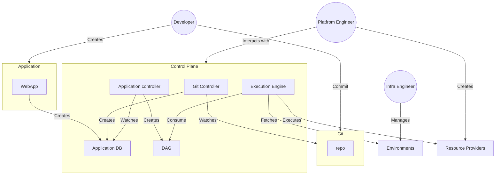

# DCM Architecture Overview

**Status:** Draft
**Date:** 2026-04-24
**Authors:** DCM Team

---

## High-Level Architecture

The diagram below shows how the three personas interact with the DCM Control Plane and how an Application flows from authoring to execution.

- **Developers** author Applications and commit them to Git, or create them directly via the self-service portal (WebApp).
- **Platform Engineers** interact with the Control Plane to define resource types and policies, and register Resource Providers that handle actual provisioning.
- **Infrastructure Operators** manage the Environments (datacenters, clusters, cloud regions) that the system provisions into.

The **Control Plane** is the core of DCM. The Git Controller watches repositories for Application changes and persists them to the Application DB. The Application Controller picks up new or updated Applications, builds a dependency DAG, and hands it to the Execution Engine. The Execution Engine fetches available Environments, resolves placement, and executes provisioning through the registered Resource Providers.

