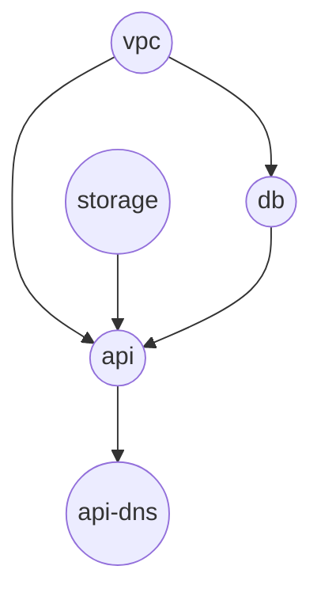

# DCM Declarative API — Payment Application

This document illustrates a single **DCM Application** that combines a relational database, a **stateless HTTP workload**, object **storage**, **network** placement, and public **DNS**. It uses **CEL** references (`${…}`) so the engine can infer a **DAG** for plan/apply ordering.

## Related documents

- [Use case: freeform Application YAML](use-case-freeform-application.md) — dev-authored **`spec.resources`**.
- [Use case: catalog items (platform templates)](use-case-catalog-items.md) — **`CatalogItem`** with **`spec.resources`**.

---

## Payment application: `payments-api`

**Story:** A payments API runs as a **stateless service**, uses **PostgreSQL**, stores receipt artifacts in an **object bucket**, is attached to a **virtual network** for private connectivity to the database, and is reachable on the internet via a **DNS name** that targets the service’s public endpoint.

**Dependency breakdown (high level):**

1. `vpc` — no intra-app dependencies.
2. `storage` (`storage.object-bucket`) — object storage for artifacts; can be created in parallel with `vpc` if the policies allow; no CEL deps on other resources.
3. `db` — depends on `vpc` for placement (`${vpc.privateSubnetIds}`); implicitly waits on network readiness.
4. `api` — depends on `db`, `storage`, and `vpc` via CEL (`connectionString`, bucket name, subnet selection).
5. `api-dns` — depends on `api` via `${api.publicHostname}`.

The DCM compiler merges **CEL-derived edges** with any explicit **`requirements`** added in the Application.

```yaml
apiVersion: dcm.io/v1alpha1
kind: Application
metadata:
  name: payments-api
  labels:
    dcm.io/environment: staging-eu
spec:
  params:
    dbName:
      type: string
      value: payments
    dnsName:
      type: string
      # Relative to spec.resources[].properties.zone (not always a FQDN in every provider)
      value: payments-api.staging

  resources:
    # Network: logical private network + subnets for data plane placement
    - name: vpc
      type: network.virtual-network
      properties:
        name: payments-staging
        region: eu-central-1
        cidr: 10.40.0.0/16

    # Storage: object bucket for artifacts (parallel to DB from an app perspective)
    - name: storage
      type: storage.object-bucket
      properties:
        name: "${params.dbName}-artifacts-staging"
        versioning: true

    # Database: PostgreSQL in private subnets supplied by the VPC resource outputs
    - name: db
      type: database.postgresql
      properties:
        dbName: "${params.dbName}"
        tier: 1
        subnetIds: "${vpc.privateSubnetIds}"

    # Stateless HTTP workload
    - name: api
      type: workloads.stateless-service
      properties:
        image: quay.io/acme/payments-api:v1.4.2
        subnetIds: "${vpc.publicSubnetIds}"
        env:
          DATABASE_URL: "${db.connectionString}"
          STORAGE_BUCKET: "${storage.name}"
        ports:
          - name: https
            port: 443
            targetPort: 8080
            public: true

    # DNS: public record targeting the service front door
    - name: api-dns
      type: dns.record-set
      properties:
        zone: example.com
        name: "${params.dnsName}"
        type: CNAME
        ttl: 300
        target: "${api.publicHostname}"
```

### Dependency DAG

Edges follow **prerequisite → dependent** (the head must be ready before the tail can be fully provisioned or wired). Circle nodes are resource **`name`** values from the YAML above.




| Prerequisite | Dependent | Driven by                 |
| ------------ | --------- | ------------------------- |
| `vpc`        | `db`      | `${vpc.privateSubnetIds}` |
| `vpc`        | `api`     | `${vpc.publicSubnetIds}`  |
| `storage`    | `api`     | `${storage.name}`         |
| `db`         | `api`     | `${db.connectionString}`  |
| `api`        | `api-dns` | `${api.publicHostname}`   |


- **Roots** (no incoming edges): `vpc`, `storage` — may start in parallel.
- **Sink / leaf** (no outgoing edges): `api-dns` — last in create order.
- **Topological levels** (example):
  - level 0 — `vpc`, `storage`
  - level 1 — `db`
  - level 2 — `api`
  - level 3 — `api-dns`

---

## Notes

- **`workloads.stateless-service`** outputs such as `publicHostname` are defined by the **resource type schema**, not by the Application author.
- **State** (mapping logical `name` → cloud IDs, last outputs, status) lives **outside** this document; the YAML is **intent only**.
- If `subnetIds` expects a list and CEL treats `vpc.privateSubnetIds` as a list, the **resource type schema** and **CEL typing** must align (this example assumes list-shaped VPC outputs).

---

## Optional: explicit ordering without CEL

If two resources must be ordered but you do not reference outputs, use **`requirements`** (ordering only), same spirit as Terraform **`depends_on`**.

```yaml
    - name: api-dns
      type: dns.record-set
      requirements:
        - api
      properties:
        zone: example.com
        name: "${params.dnsName}"
        type: CNAME
        ttl: 300
        target: "${api.publicHostname}"
```

Here `requirements` is redundant because **`${api.publicHostname}`** already implies **`api-dns` → `api`**, but it is valid when you want an explicit gate without wiring fields.