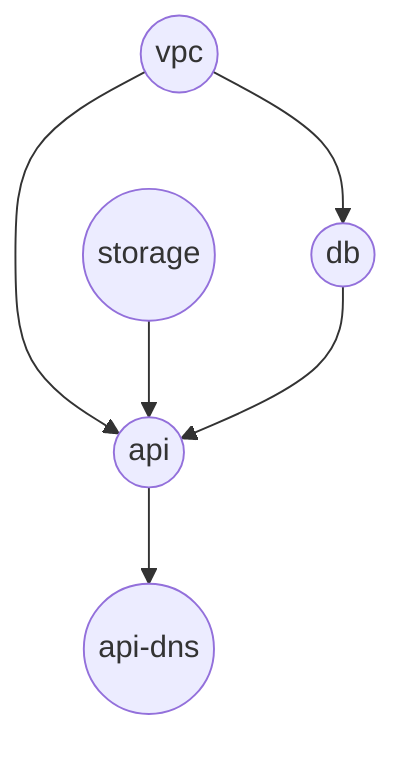

# Use case: Freeform Application YAML — declarative API

**Personas** 
- Platform engineer registers `resource types`, `policies`, and `limits` in the platform. 
- Dev user authors a full `Application` YAML: `spec.resources` 
  (and `spec.params` if they want reusable inputs), `CEL` wiring, and optional `requirements`. 
  This is the same expressive power as the internal “full graph” model, without selecting a `CatalogItem`.

This document explains the recommended declarative shape, tradeoffs, and a full example aligned with `payment-api.md`.

## Recommended declarative pattern


| Layer                  | Owner             | What is stored                                                                        | Purpose                                                                                |
|------------------------| ----------------- |---------------------------------------------------------------------------------------|----------------------------------------------------------------------------------------|
| Resource type registry | Platform engineer | Schemas, quotas, which types exist per env                                            | **Consume, don’t define** at the type level. Devs pick registered `type` values only |
| Application          | Dev user          | `spec.params` (optional) + `spec.resources[]` with `properties`/`CEL` /`requirements` | Full desired topology in one declarative unit (Git, API, portal)                       |


**Compile-time flow**

1. **RBAC/Policy:** For each environment, restrict which `type` values (resource kinds) 
   may appear in an `Application`, including allowlists, allowed regions, and limits on fields such as `tier`.
2. **Schema validation** for every resource against registered types.
3. **CEL + DAG** validation (cycles, unknown refs, conditional soundness).
4. **Plan / apply** using external state (unchanged from the core engine model).

There is **no** catalog row required for the graph to exist; the `Application` YAML is the source of topology for that app.


## Advantages

- **Maximum flexibility:** New shapes (extra sidecar bucket, second DNS, read replica) 
  without waiting on a new `CatalogItem` version.
- **Fits advanced users and GitOps:** One file describes the whole app; diffs are explicit in PRs.
- **Faster iteration** for new workstreams and for platform engineering to ship out workloads without waiting on new `CatalogItems`.


## Disadvantages

- **Weaker guardrails by default:** Easier to misconfigure (wrong subnet ref, oversized DB tier, missing `requirements` edge).
- **Larger review surface:** Reviewers must understand **every** resource block, not only params.
- **Support and cost risk:** Without strong policy engines, tenants can request non-standard or expensive combinations.
- **Duplication:** Many teams copy-paste similar YAML unless you still offer optional catalog items or snippets as convenience.


## When to prefer this model

- Mature dev orgs with strong CI/policy (OPA, custom validators) on `Application`.
- Internal platform teams or early DCM phases where catalog breadth is not ready.
- Use cases where topology varies too much to catalog every variant.


## Example: full Application (dev user YAML)

Same story as `payment-api.md`: PostgreSQL, object storage, VPC, stateless HTTP workload, DNS.
Dev supplies the entire graph.

```yaml
apiVersion: dcm.io/v1alpha1
kind: Application
metadata:
  name: acme-payments-freeform
  labels:
    dcm.io/environment: staging-eu
spec:
  params:
    appId:
      type: string
      value: acme
    image:
      type: string
      value: quay.io/acme/payments-api:v1.9.0
    dnsName:
      type: string
      value: payments-acme.staging

  resources:
    - name: vpc
      type: network.virtual-network
      properties:
        name: "${params.appId}-payments-staging"
        region: eu-central-1
        cidr: 10.40.0.0/16

    - name: storage
      type: storage.object-bucket
      properties:
        name: "${params.appId}-payments-artifacts-staging"
        versioning: true

    - name: db
      type: database.postgresql
      properties:
        dbName: "${params.appId}-payments"
        tier: 1
        subnetIds: "${vpc.privateSubnetIds}"

    - name: api
      type: workloads.stateless-service
      properties:
        image: "${params.image}"
        subnetIds: "${vpc.publicSubnetIds}"
        env:
          DATABASE_URL: "${db.connectionString}"
          STORAGE_BUCKET: "${storage.name}"
        ports:
          - name: https
            port: 443
            targetPort: 8080
            public: true

    - name: api-dns
      type: dns.record-set
      properties:
        zone: example.com
        name: "${params.dnsName}"
        type: CNAME
        ttl: 300
        target: "${api.publicHostname}"
```


## Dependency DAG (same topology as catalog materialization)




## Comparison at a glance (vs catalog model)

| Topic               | Freeform `Application`             | Catalog-driven `Application`      |
| ------------------- | ---------------------------------- | --------------------------------- |
| **Topology source** | Dev YAML                           | CatalogItem `spec.resources` in DB |
| **Pre-requisite**   | Registered resource types + policy | Published `CatalogItem`          |
| **Typical PR size** | Large                              | Small (params only)               |
| **Optimal for**     | Variation, advanced users          | Standard stacks, governance       |


See also: `use-case-catalog-items.md` (catalog path).

---

## Open questions

1. **Catalog-only vs catalog + freeform (product / policy decision)**
  Should DCM **enforce** that every `Application` must be an instance of a referenced `CatalogItem`
  (catalog-only mode in some environments), or should the platform **allow both**: 
  (a) **catalog-backed** applications that reference a published `CatalogItem`, 
  (b) **freeform** applications with `spec.resources` and **no** `fromCatalog`, while **CatalogItems** remain in the 
  catalog DB as an **optional** library of templates (including templates **not** referenced by any running app)?
