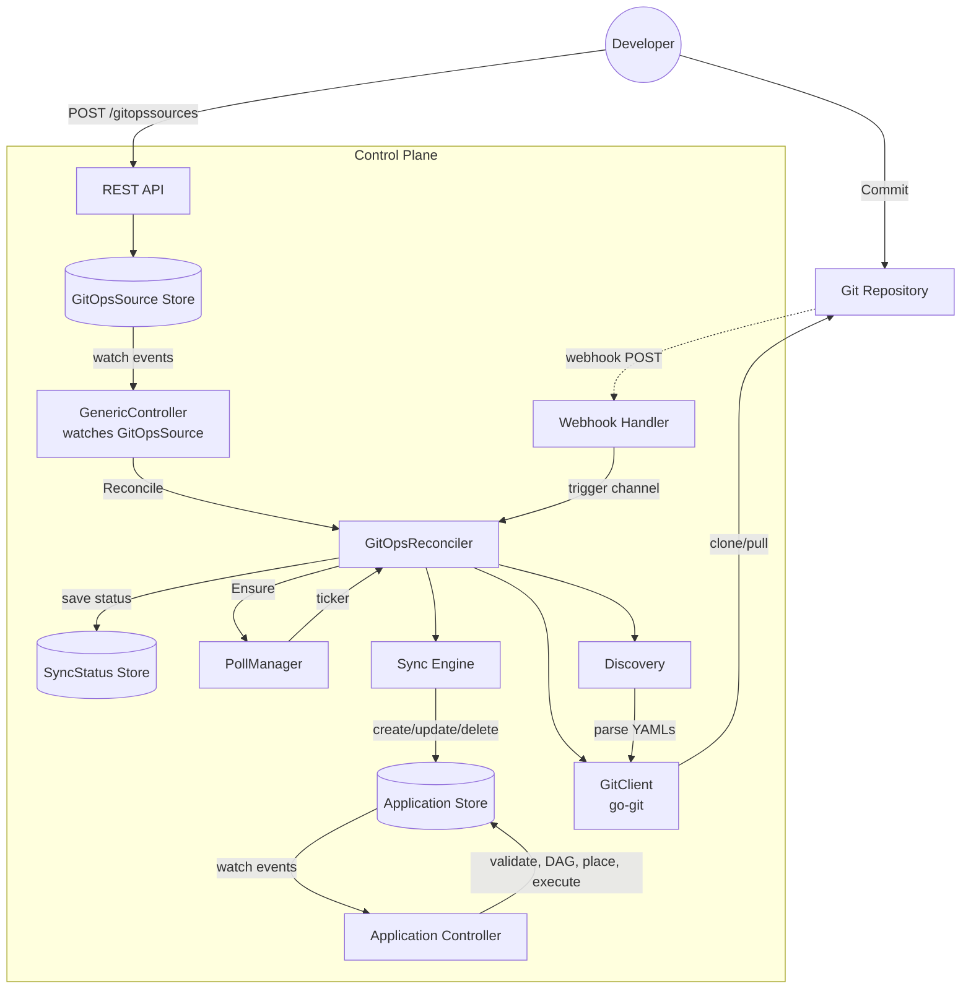
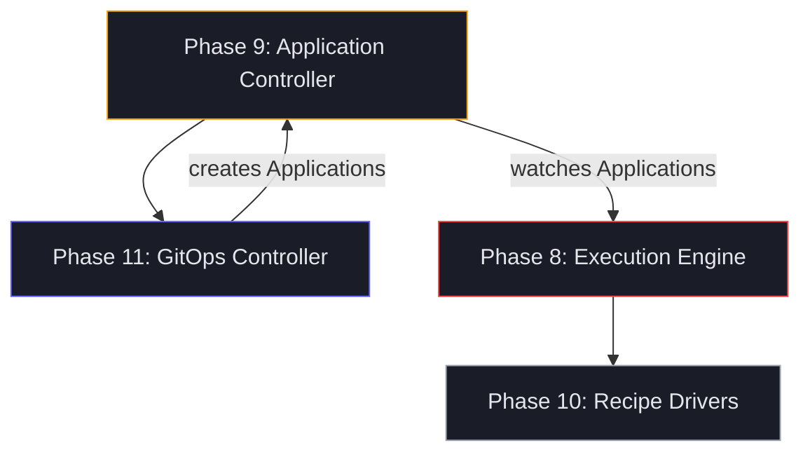

# DCM GitOps Design Document

**Status:** Implemented
**Date:** 2026-05-13
**Authors:** DCM Team

---

## 1. Overview

The GitOps controller enables a "commit to deploy" workflow for DCM. Developers commit Application YAML files to a Git repository, and the DCM control plane automatically discovers, syncs, and reconciles them into the store. This triggers the downstream Application Controller pipeline (validate, build DAG, place, execute).

The design follows the same patterns as ArgoCD and nomad-ops: a reconciliation loop that continuously compares the desired state (Git) against the actual state (store) and drives convergence.

### 1.1 Design Principles

1. **Git is the source of truth.** Application definitions live in Git repositories. The store reflects Git, not the other way around.

2. **Ownership tracking.** Only Applications created by a GitOpsSource are managed by it. Manually created Applications are never modified or deleted by the sync process.

3. **Event-driven with polling fallback.** Webhooks trigger immediate reconciliation. Polling ensures convergence even if webhooks are missed.

4. **In-process controller.** The GitOps controller runs inside the dcm-server process, reusing the existing store, repository, and controller infrastructure. No separate binary or gRPC protocol is needed.

5. **Incremental sync.** Only changed Applications are created, updated, or deleted. Unchanged resources are left alone.

### 1.2 Why Not gRPC?

DCM already has a complete watch infrastructure built on kine's etcd API:

```
store.Watch (kine/etcd) -> repository.Watch (typed channels) -> GenericController (reconcile loop)
```

Since the GitOps controller runs in-process, it communicates with the store via Go channels — no network protocol is needed between components. gRPC is already an indirect dependency (via kine/etcd client) but adding it as a first-class API layer would introduce proto files, a codegen toolchain, and a dual API surface without solving any actual problem.

gRPC streaming would become relevant if DCM needs to expose a watch API to external clients (CLI, UI, other services), but that is a separate concern from GitOps.

---

## 2. Architecture

### 2.1 Component Diagram



### 2.2 Data Flow

```
1. Developer creates a GitOpsSource via REST API
2. GenericController detects the new resource via store watch
3. GitOpsReconciler.Reconcile(name) is called:
   a. Fetch GitOpsSource spec (repoURL, branch, path, interval)
   b. Clone or pull the Git repository
   c. Discover Application YAML files in the configured path
   d. Compare desired (Git) vs actual (store) for managed Applications
   e. Create/update/delete Applications to match Git
   f. Save SyncStatus to store
   g. Start/update polling goroutine
4. Application changes trigger the Application Controller pipeline
5. Subsequent changes detected via:
   - Webhook -> immediate reconciliation
   - PollManager -> periodic reconciliation
   - GitOpsSource update -> re-reconciliation
```

---

## 3. GitOpsSource Resource

The `GitOpsSource` is a new DCM resource type that defines a Git repository to watch.

### 3.1 Schema

```yaml
apiVersion: dcm.io/v1alpha1
kind: GitOpsSource
metadata:
  name: my-apps
spec:
  repoURL: "https://github.com/org/app-configs.git"
  branch: main                  # optional, default: "main"
  path: "applications/"         # optional, default: "."
  pollInterval: "30s"           # optional, default: "30s"
  webhookSecret: "my-secret"    # optional, for webhook validation
```

### 3.2 Field Reference

| Field | Required | Default | Description |
|-------|----------|---------|-------------|
| `spec.repoURL` | Yes | — | Git repository URL (HTTPS or SSH). |
| `spec.branch` | No | `main` | Branch to track. |
| `spec.path` | No | `.` | Directory within the repo to scan for YAML files. |
| `spec.pollInterval` | No | `30s` | How often to poll for changes. Go duration string. |
| `spec.webhookSecret` | No | — | HMAC-SHA256 secret for webhook signature validation. |

### 3.3 API Endpoints

| Method | Path | Description |
|--------|------|-------------|
| `POST` | `/apis/dcm.io/v1alpha1/gitopssources` | Create a GitOpsSource |
| `GET` | `/apis/dcm.io/v1alpha1/gitopssources` | List all GitOpsSources |
| `GET` | `/apis/dcm.io/v1alpha1/gitopssources/{name}` | Get a GitOpsSource |
| `PUT` | `/apis/dcm.io/v1alpha1/gitopssources/{name}` | Update a GitOpsSource |
| `DELETE` | `/apis/dcm.io/v1alpha1/gitopssources/{name}` | Delete a GitOpsSource |
| `POST` | `/apis/dcm.io/v1alpha1/webhooks/gitops/{name}` | Trigger reconciliation via webhook |

---

## 4. Reconciliation

### 4.1 Reconciler

The `GitOpsReconciler` implements `controller.Reconciler` and is driven by three trigger sources:

| Trigger | Mechanism | Description |
|---------|-----------|-------------|
| Store watch | `GenericController` detects GitOpsSource create/update/delete | Immediate on resource change |
| Webhook | HTTP POST to `/webhooks/gitops/{name}`, sends name to trigger channel | Immediate on Git push |
| Polling | `PollManager` ticker fires at `pollInterval` | Periodic fallback |

All three call the same `Reconcile(ctx, name)` method. A per-source mutex prevents concurrent reconciles for the same source.

### 4.2 Reconcile Flow

```
Reconcile(ctx, name):
  1. Get GitOpsSource from store
     - If not found (deleted) -> cleanup: stop poller, delete managed apps, remove clone
  2. Apply defaults (branch, path, pollInterval)
  3. Get or create GitClient for this source
  4. CloneOrPull -> get latest commit hash
  5. DiscoverApplications(cloneDir, path)
     - Walk directory, read *.yaml/*.yml files
     - Decode via codec, filter to kind=Application
  6. Sync(ctx, sourceName, desiredApps, appRepo)
  7. Save SyncStatus to /registry/gitopsstatus/{name}
  8. PollManager.Ensure(ctx, name, interval)
```

### 4.3 Sync Algorithm

The sync engine compares desired state (from Git) against actual state (from store) and reconciles the difference.

```
Sync(ctx, sourceName, desired, appRepo):
  1. List all Applications in store
  2. Filter to those with annotation "dcm.io/managed-by: gitops/{sourceName}"
     -> actualManaged map[name] -> (app, revision)
  3. For each desired app, set annotation "dcm.io/managed-by: gitops/{sourceName}"
  4. CREATE: apps in desired but not in actualManaged
     - Skip if an unmanaged app with the same name exists (log warning)
  5. UPDATE: apps in both maps with different spec
     - Uses optimistic concurrency (compare-and-swap on revision)
  6. DELETE: apps in actualManaged but not in desired
```

### 4.4 Ownership Model

Applications managed by GitOps are annotated:

```yaml
metadata:
  annotations:
    dcm.io/managed-by: "gitops/my-apps"
```

This ensures:
- **Safety:** The sync engine only modifies Applications it owns. Manually created Applications are never touched.
- **Multi-source:** Multiple GitOpsSources can manage different Applications without conflict.
- **Cleanup:** When a GitOpsSource is deleted, only its managed Applications are removed.

If a desired Application name collides with an existing unmanaged Application, the sync logs a warning and skips the create — it does not take ownership.

---

## 5. Webhook

### 5.1 Endpoint

```
POST /apis/dcm.io/v1alpha1/webhooks/gitops/{name}
```

### 5.2 Authentication

If the GitOpsSource has a `webhookSecret`, the handler validates the request using HMAC-SHA256:

1. Read the request body
2. Compute `HMAC-SHA256(body, secret)`
3. Compare with `X-Hub-Signature-256` header (GitHub format: `sha256=<hex>`) or `X-Webhook-Signature` header
4. Reject with `401 Unauthorized` if the signature doesn't match

This is compatible with GitHub, GitLab, and most Git hosting webhook formats.

### 5.3 Trigger Flow

The webhook handler sends the source name to a buffered channel (non-blocking). A separate `RunTriggerLoop` goroutine reads from this channel and calls `Reconcile`. If the channel is full (reconciliation already queued), the webhook returns success but the duplicate trigger is dropped.

---

## 6. Polling

### 6.1 PollManager

The `PollManager` maintains one ticker goroutine per GitOpsSource. Each poller:

1. Fires at `pollInterval` (default 30s)
2. Calls `Reconcile(ctx, name)` on each tick
3. Logs errors but continues polling

### 6.2 Lifecycle

| Event | Action |
|-------|--------|
| GitOpsSource created | Start poller at configured interval |
| GitOpsSource updated with new interval | Stop old poller, start new one |
| GitOpsSource deleted | Stop poller |
| Server shutdown | `StopAll()` cancels all pollers |

---

## 7. Git Operations

### 7.1 GitClient

Uses `go-git` (pure Go, no CGO) for Git operations:

- **Clone:** Shallow clone (`depth=1`), single branch, into `{dataDir}/gitops-clones/{source-name}/`
- **Pull:** Fast-forward pull with force (handles force-pushes to the branch)
- **Cleanup:** Removes the local clone directory when a source is deleted

### 7.2 Discovery

The discovery phase walks the configured `path` within the clone:

1. Find all `*.yaml` and `*.yml` files (recursive walk)
2. Decode each file via `codec.Decode()` — the same codec used by the REST API
3. Filter to `kind: Application` — other resource kinds are silently skipped
4. Return the list of Applications and any decode errors (non-fatal, logged as warnings)

---

## 8. Sync Status

Each GitOpsSource has a corresponding status record stored at `/registry/gitopsstatus/{name}`.

```json
{
  "phase": "Synced",
  "lastSync": "2026-05-13T10:30:00Z",
  "commitHash": "abc123def456...",
  "created": 2,
  "updated": 1,
  "deleted": 0,
  "message": ""
}
```

| Phase | Description |
|-------|-------------|
| `Synced` | Last sync completed successfully |
| `Error` | Last sync failed (see `message` field) |

---

## 9. Controller Wiring

The GitOps controller is wired into the existing server startup in `internal/server/server.go`:

```
server.New(ctx, cfg):
  1. Create kine store
  2. Create API server (registers all routes including GitOpsSource CRUD)
  3. Create GitOpsReconciler (with source repo, app repo, store, clone dir)
  4. Register webhook handler on mux
  5. Start API server
  6. Start GenericController[*GitOpsSource] (goroutine)
  7. Start RunTriggerLoop (goroutine)
```

### 9.1 Delete Event Handling

The `GenericController` was updated to pass delete events to reconcilers (previously skipped). For delete events, the resource name is extracted from the store key (`path.Base(key)`) since the object value is empty. This enables the GitOpsReconciler to clean up managed Applications when a GitOpsSource is deleted.

The existing `ApplicationReconciler` handles "not found" gracefully, so this change is backwards-compatible.

---

## 10. Package Structure

```
pkg/
  gitops/
    git.go              # GitClient: clone/pull wrapper (go-git)
    discovery.go        # DiscoverApplications: find and parse YAML files
    sync.go             # Sync: desired vs actual reconciliation engine
    reconciler.go       # GitOpsReconciler: orchestrates the full cycle
    poller.go           # PollManager: per-source polling goroutines
    webhook.go          # WebhookHandler: HTTP handler for Git webhooks
```

---

## 11. Example Workflow

### 11.1 Setup

```bash
# Create a GitOpsSource
curl -X POST http://localhost:8080/apis/dcm.io/v1alpha1/gitopssources \
  -H "Content-Type: application/yaml" \
  -d '
apiVersion: dcm.io/v1alpha1
kind: GitOpsSource
metadata:
  name: team-alpha-apps
spec:
  repoURL: "https://github.com/team-alpha/dcm-apps.git"
  branch: main
  path: "applications/"
  pollInterval: "60s"
  webhookSecret: "s3cret"
'
```

### 11.2 Repository Layout

```
dcm-apps/
  applications/
    web-app.yaml          # kind: Application
    api-service.yaml      # kind: Application
    shared-db.yaml        # kind: Application
    resourcetypes/
      database.yaml       # kind: ResourceType (ignored — not Application)
```

Only `web-app.yaml`, `api-service.yaml`, and `shared-db.yaml` are synced.

### 11.3 Sync Cycle

1. GitOps controller clones the repo on first reconciliation
2. Discovers 3 Application files
3. Creates them in the store with annotation `dcm.io/managed-by: gitops/team-alpha-apps`
4. Application Controller picks up the new Applications and runs the provisioning pipeline
5. On subsequent pushes, the webhook triggers re-sync — only changed Applications are updated

### 11.4 GitHub Webhook Configuration

In the GitHub repository settings:

| Setting | Value |
|---------|-------|
| Payload URL | `https://dcm.example.com/apis/dcm.io/v1alpha1/webhooks/gitops/team-alpha-apps` |
| Content type | `application/json` |
| Secret | `s3cret` |
| Events | Push events |

---

## 12. Concurrency and Safety

| Concern | Mitigation |
|---------|-----------|
| Concurrent reconciles (webhook + poll + watch) | Per-source mutex — only one reconcile runs at a time, others are dropped |
| Ownership conflicts (two sources, same app name) | Annotation-based ownership — skip with warning if app exists under different ownership |
| Optimistic concurrency (store revision conflicts) | Fetch latest revision before update/delete, retry on conflict |
| Large repositories | Shallow clone (`depth=1`), single branch only |
| Disk accumulation | Clone dir cleaned up on source deletion; stored under `{dataDir}/gitops-clones/` |

---

## 13. Relationship to Other Phases



The GitOps controller sits at the top of the pipeline. It creates Applications in the store, which triggers the existing Application Controller. The GitOps controller has no knowledge of DAGs, placement, or execution — it only manages the desired state of Application resources.

---

## 14. Future Considerations

These are out of scope for the current implementation but may be addressed later:

- **Multi-resource sync:** Extend to sync Environments, ResourceTypes, Recipes, and PlacementPolicies from Git (currently Applications only).
- **SSH authentication:** Support SSH key-based Git auth for private repositories.
- **Drift detection:** Detect when store state diverges from Git without a Git change (e.g., manual API edits to managed Applications).
- **Prune policies:** Configurable behavior for what happens when an Application is removed from Git (delete immediately, mark for review, etc.).
- **Status API:** Expose SyncStatus via a dedicated REST endpoint (`GET /apis/dcm.io/v1alpha1/gitopssources/{name}/status`).
- **gRPC watch API:** If external clients need real-time resource change streams, add gRPC server-side streaming as a separate API surface alongside REST.
