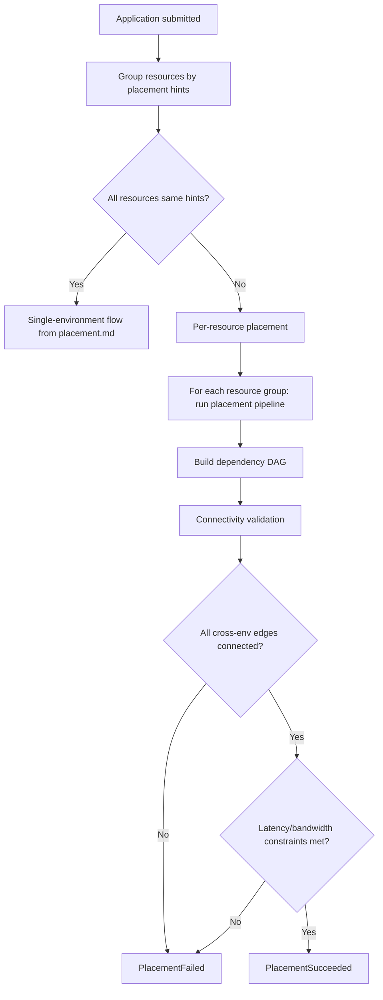

# DCM Multi-Environment Placement & Cross-Environment Networking Design Document

**Status:** Draft
**Date:** 2026-04-27
**Authors:** DCM Team

---

## 1. Overview

By default, all resources in an Application are placed in a single environment (see [placement.md](placement.md), Section 6.1). However, some applications require resources in different environments -- for example, a database in the EU for GDPR compliance and compute close to users in the US.

This document designs **per-resource placement** and the **cross-environment networking** model that ensures applications continue to work when their resources span multiple environments.

### 1.1 Design Principles

1. **Connectivity-aware.** The placement engine understands which environments can reach each other and rejects placements that would break networking.

2. **Fail-safe.** If connectivity between two environments cannot be proven, placement is rejected. The system never assumes environments can communicate.

3. **Overlay-agnostic.** The connectivity model supports any overlay technology (Submariner, Skupper, Cilium ClusterMesh) and native infrastructure peering (VPC peering, VPN, direct interconnect) without coupling to a specific implementation.

4. **DAG-driven validation.** Only resources that actually reference each other (via CEL expressions or explicit requirements) need connectivity between their environments. Independent resources can be in disconnected environments.

---

## 2. Connectivity Model

Two mechanisms establish connectivity between environments: **overlays** and **native peering**. The control plane combines both into a unified **connectivity graph**.

### 2.1 Overlays

An environment declares membership in named overlay networks. Two environments sharing an overlay can reach each other at the application layer.

Overlays are declared in the Environment spec under `networking.overlays`:

```yaml
networking:
  overlays:
    - name: eu-mesh
      type: submariner
    - name: global-service-mesh
      type: skupper
```

#### Overlay Fields

| Field | Required | Type | Description |
|-------|----------|------|-------------|
| `name` | Yes | string | Name of the overlay network. Environments sharing the same name are connected. |
| `type` | Yes | string | Overlay technology: `submariner`, `skupper`, `cilium-clustermesh`, `istio-multicluster`. |
| `latency` | No | string | Measured or expected latency across this overlay (e.g., `5ms`, `80ms`). |
| `bandwidth` | No | string | Available bandwidth (e.g., `10Gbps`, `1Gbps`). |

#### How It Works

```
Environment A                    Environment B
networking:                      networking:
  overlays:                        overlays:
    - name: eu-mesh    ======>       - name: eu-mesh
      type: submariner               type: submariner

A and B share overlay "eu-mesh" => A <-> B are connected
```

### 2.2 Native Peering

For environments connected through infrastructure-level mechanisms (VPC peering, VPN tunnels, direct interconnects), operators declare an `EnvironmentPeering` resource. Peering is bidirectional.

```yaml
apiVersion: dcm.io/v1alpha1
kind: EnvironmentPeering
metadata:
  name: eu-us-vpn
spec:
  environments:
    - prod-eu-k8s-01
    - prod-us-k8s-01
  type: vpn
  latency: 85ms
  bandwidth: 10Gbps
```

#### EnvironmentPeering Fields

| Field | Required | Type | Description |
|-------|----------|------|-------------|
| `metadata.name` | Yes | string | Unique peering name. |
| `spec.environments` | Yes | list&lt;string&gt; (exactly 2) | The two environment names being connected. |
| `spec.type` | Yes | string | Peering type: `vpn`, `vpc-peering`, `direct-interconnect`. |
| `spec.latency` | No | string | Measured or expected round-trip latency (e.g., `85ms`). |
| `spec.bandwidth` | No | string | Available bandwidth (e.g., `10Gbps`). |

### 2.3 Connectivity Graph

The control plane builds and maintains a connectivity graph from all overlay memberships and peering declarations. Two environments are **connected** if:

- They share at least one overlay (same overlay `name`), **OR**
- An `EnvironmentPeering` resource declares them as peers.

```
Connectivity Graph
==================

  prod-eu-k8s-01 ----[eu-mesh/submariner]---- prod-eu-k8s-02
        |
        |---[eu-us-vpn/vpn, 85ms]---
        |                            |
  prod-us-k8s-01 ----[us-mesh/submariner]---- prod-us-k8s-02
        |
        |---[us-onprem/direct-interconnect]---
        |
  onprem-us-vmware-01
```

The graph is queried during placement to validate that cross-environment resource references have connectivity.

---

## 3. Per-Resource Placement

### 3.1 Placement Hints

Individual resources in an Application can declare placement hints via a `placement` field. These hints are matched against PlacementPolicies (see [placement.md](placement.md)) to select a specific environment for that resource.

```yaml
apiVersion: dcm.io/v1alpha1
kind: Application
metadata:
  name: global-app
  labels:
    team: platform
spec:
  resources:
    - name: db
      type: database.postgresql
      placement:
        labels:
          compliance: gdpr
          region: eu
      properties:
        size: L

    - name: api
      type: compute.container
      placement:
        labels:
          region: us
      properties:
        image: quay.io/app/api
        dbUrl: "${db.connectionString}"

    - name: cache
      type: cache.redis
      properties:
        memoryGB: 4
```

### 3.2 Placement Hint Fields

| Field | Required | Type | Description |
|-------|----------|------|-------------|
| `placement.labels` | No | map&lt;string, string&gt; | Labels added to the resource's effective label set for policy matching. Merged with Application-level labels. |
| `placement.environment` | No | string | Pin this resource to a specific environment by name. Bypasses policy evaluation for this resource. |

### 3.3 Resolution Rules

1. **Resources with `placement.environment`**: pinned directly to the named environment. No policy evaluation.
2. **Resources with `placement.labels`**: the resource's labels are the Application labels merged with the placement labels (placement labels take precedence). Policies are matched and evaluated against the merged label set.
3. **Resources without `placement`**: inherit the Application-level placement result.

---

## 4. Connectivity Validation

When resources in an Application are placed in different environments, the placement engine validates that all cross-environment dependencies have connectivity.

### 4.1 Validation Algorithm

1. Build the Application's dependency DAG (from CEL references and explicit `requirements`).
2. For each edge in the DAG (resource A depends on resource B):
   - Resolve the environment for A and the environment for B.
   - If they are in the **same** environment: pass (no cross-env networking needed).
   - If they are in **different** environments: query the connectivity graph for a path between the two environments.
3. If any dependency edge lacks connectivity: **placement fails**.

```
DAG:  api -> db       (api references ${db.connectionString})
      api -> cache    (api references ${cache.host})

Environments:
  db    -> prod-eu-k8s-01
  api   -> prod-us-k8s-01
  cache -> prod-us-k8s-01  (inherited from app-level, same as api)

Connectivity check:
  api(prod-us-k8s-01) -> db(prod-eu-k8s-01): need connectivity
    => eu-us-vpn peering exists => PASS
  api(prod-us-k8s-01) -> cache(prod-us-k8s-01): same environment => PASS

Result: placement succeeds
```

### 4.2 Error Reporting

When connectivity validation fails, the error identifies the specific resources and environments:

```
PlacementFailed: no connectivity between environments for dependent resources.

  Resource "api" (prod-us-k8s-01) depends on "db" (prod-asia-k8s-01)
    via: ${db.connectionString}
    environments prod-us-k8s-01 and prod-asia-k8s-01 have no overlay or peering.

  To resolve:
    - Create an EnvironmentPeering between prod-us-k8s-01 and prod-asia-k8s-01
    - Or add both environments to a shared overlay network
    - Or adjust placement hints so both resources land in the same environment
```

---

## 5. Cross-Environment CEL Context

### 5.1 Overlay Access in CEL

The `env.networking.overlays` field is available in placement expressions:

```
env.networking.overlays              -> list<Overlay>
env.networking.overlays[*].name      -> string
env.networking.overlays[*].type      -> string
env.networking.overlays[*].latency   -> string
env.networking.overlays[*].bandwidth -> string
```

### 5.2 Built-in Functions

| Function | Signature | Description |
|----------|-----------|-------------|
| `connected` | `(string, string) -> bool` | Returns `true` if two environments (by name) have connectivity (overlay or peering). |
| `linkLatency` | `(string, string) -> duration` | Returns the latency between two environments. Returns `0` if same environment. Fails if not connected. |
| `linkBandwidth` | `(string, string) -> string` | Returns the bandwidth between two environments. |

### 5.3 Usage in Placement Rules

```cel
# Ensure this environment is connected to the EU database environment
connected(env.metadata.name, "prod-eu-k8s-01")

# Ensure latency to a specific environment is under 100ms
linkLatency(env.metadata.name, "prod-eu-k8s-01") < duration("100ms")

# Environment must be part of the eu-mesh overlay
env.networking.overlays.exists(o, o.name == "eu-mesh")
```

---

## 6. Placement Flow (Multi-Environment Extension)

This extends the evaluation flow from [placement.md](placement.md), Section 4.



### 6.1 Steps

1. **Group resources by placement hints.** Resources with identical placement hints (or no hints) are grouped together.

2. **Check if multi-env is needed.** If all resources have the same hints (or none), fall back to the single-environment flow from placement.md.

3. **Per-resource placement.** For each resource group, run the standard placement pipeline (pre-filter, match policies, evaluate rules, score preferences, select environment).

4. **Build dependency DAG.** Construct the resource dependency graph from CEL references and explicit requirements.

5. **Connectivity validation.** For each edge in the DAG where the two resources are in different environments, verify connectivity exists in the connectivity graph.

6. **Latency and bandwidth validation.** If resources declare latency or bandwidth requirements, verify the cross-environment link meets them.

7. **Result.** If all validations pass, placement succeeds. Otherwise, placement fails with detailed error.

---

## 7. Latency and Bandwidth Constraints

Resources can optionally declare network requirements for their dependencies:

```yaml
resources:
  - name: api
    type: compute.container
    placement:
      labels:
        region: us
      networkRequirements:
        - target: db
          maxLatency: 50ms
          minBandwidth: 1Gbps
    properties:
      image: quay.io/app/api
      dbUrl: "${db.connectionString}"
```

### 7.1 Network Requirement Fields

| Field | Required | Type | Description |
|-------|----------|------|-------------|
| `target` | Yes | string | Name of the dependent resource. |
| `maxLatency` | No | string | Maximum acceptable round-trip latency (e.g., `50ms`). |
| `minBandwidth` | No | string | Minimum acceptable bandwidth (e.g., `1Gbps`). |

### 7.2 Validation

The placement engine compares the declared requirements against the connectivity link's `latency` and `bandwidth` metadata:

- If the link's latency exceeds `maxLatency`: placement fails.
- If the link's bandwidth is below `minBandwidth`: placement fails.
- If the link has no latency/bandwidth metadata and constraints are declared: placement emits a warning (cannot verify).

---

## 8. Examples

### 8.1 GDPR Database in EU + Compute in US

Database must stay in the EU for GDPR compliance. API server is placed close to US users. Connected via VPN.

```yaml
# EnvironmentPeering
apiVersion: dcm.io/v1alpha1
kind: EnvironmentPeering
metadata:
  name: eu-us-vpn
spec:
  environments:
    - prod-eu-k8s-01
    - prod-us-k8s-01
  type: vpn
  latency: 85ms
  bandwidth: 10Gbps
---
# Application
apiVersion: dcm.io/v1alpha1
kind: Application
metadata:
  name: global-store
  labels:
    team: commerce
spec:
  resources:
    - name: db
      type: database.postgresql
      placement:
        labels:
          compliance: gdpr
          region: eu
      properties:
        size: L
        multiAZ: true

    - name: api
      type: compute.container
      placement:
        labels:
          region: us
      properties:
        image: quay.io/store/api
        dbUrl: "${db.connectionString}"
```

**Result:** `db` placed in `prod-eu-k8s-01` (GDPR policy), `api` placed in `prod-us-k8s-01` (US region policy). VPN peering exists between them. Placement succeeds.

### 8.2 Multi-Cluster Kubernetes with Submariner

Two Kubernetes clusters in the same region connected via Submariner overlay.

```yaml
# Environment 1
apiVersion: dcm.io/v1alpha1
kind: Environment
metadata:
  name: k8s-eu-01
spec:
  type: kubernetes
  networking:
    overlays:
      - name: eu-mesh
        type: submariner
        latency: 2ms
        bandwidth: 25Gbps
    features:
      - public-ip
      - load-balancer
  # ... other fields
---
# Environment 2
apiVersion: dcm.io/v1alpha1
kind: Environment
metadata:
  name: k8s-eu-02
spec:
  type: kubernetes
  networking:
    overlays:
      - name: eu-mesh
        type: submariner
        latency: 2ms
        bandwidth: 25Gbps
    features:
      - gpu
  # ... other fields
---
# Application
apiVersion: dcm.io/v1alpha1
kind: Application
metadata:
  name: ml-pipeline
  labels:
    team: data-science
spec:
  resources:
    - name: trainer
      type: compute.container
      placement:
        labels:
          workload: gpu
      properties:
        image: quay.io/ml/trainer
        modelEndpoint: "${inference.endpoint}"

    - name: inference
      type: compute.container
      placement:
        labels:
          workload: serving
      properties:
        image: quay.io/ml/inference
```

**Result:** `trainer` placed in `k8s-eu-02` (has GPU), `inference` placed in `k8s-eu-01` (serving). Both share `eu-mesh` overlay. Placement succeeds.

### 8.3 Hybrid Cloud: On-Prem VMware + AWS

Legacy database on-premises, modern API on AWS. Connected via direct interconnect.

```yaml
# EnvironmentPeering
apiVersion: dcm.io/v1alpha1
kind: EnvironmentPeering
metadata:
  name: onprem-aws-interconnect
spec:
  environments:
    - onprem-us-vmware-01
    - aws-us-east-prod
  type: direct-interconnect
  latency: 5ms
  bandwidth: 100Gbps
---
# Application
apiVersion: dcm.io/v1alpha1
kind: Application
metadata:
  name: hybrid-erp
  labels:
    team: enterprise
spec:
  resources:
    - name: legacy-db
      type: compute.virtual-machine
      placement:
        environment: onprem-us-vmware-01
      properties:
        cpu: 8
        memory: 32GiB
        os: "rhel-10"

    - name: api
      type: compute.container
      placement:
        labels:
          provider: aws
      properties:
        image: quay.io/erp/api
        dbHost: "${legacy-db.privateIP}"
```

**Result:** `legacy-db` pinned to `onprem-us-vmware-01`, `api` placed in `aws-us-east-prod`. Direct interconnect exists. Placement succeeds.

### 8.4 Failed Placement: No Connectivity

```yaml
apiVersion: dcm.io/v1alpha1
kind: Application
metadata:
  name: disconnected-app
  labels:
    team: platform
spec:
  resources:
    - name: db
      type: database.postgresql
      placement:
        environment: prod-asia-k8s-01
      properties:
        size: M

    - name: api
      type: compute.container
      placement:
        environment: prod-us-k8s-01
      properties:
        image: quay.io/app/api
        dbUrl: "${db.connectionString}"
```

**Result:**

```
PlacementFailed: no connectivity between environments for dependent resources.

  Resource "api" (prod-us-k8s-01) depends on "db" (prod-asia-k8s-01)
    via: ${db.connectionString}
    environments prod-us-k8s-01 and prod-asia-k8s-01 have no overlay or peering.
```

---

## 9. Impact on Environment Spec

This design adds `networking.overlays` to the Environment spec defined in [environment.md](environment.md).

### 9.1 Addition to `networking`

```yaml
networking:
  features:
    - public-ip
    - ipv6
  overlays:
    - name: eu-mesh
      type: submariner
      latency: 2ms
      bandwidth: 25Gbps
  zones:
    - name: internal
      subnets:
        - name: app-subnet
          cidr: "10.0.10.0/22"
```

### 9.2 New Fields

| Field | Required | Type | Description |
|-------|----------|------|-------------|
| `networking.overlays` | No | list&lt;Overlay&gt; | Overlay networks this environment participates in. |
| `networking.overlays[].name` | Yes | string | Overlay network name. Environments with the same name are connected. |
| `networking.overlays[].type` | Yes | string | Technology: `submariner`, `skupper`, `cilium-clustermesh`, `istio-multicluster`. |
| `networking.overlays[].latency` | No | string | Expected latency across this overlay. |
| `networking.overlays[].bandwidth` | No | string | Available bandwidth across this overlay. |

---

## 10. Validation

### 10.1 Environment Overlays

| Check | Description |
|-------|-------------|
| **Overlay name uniqueness** | An environment cannot join the same overlay twice. |
| **Overlay type** | Must be a recognized overlay type. |
| **Latency/bandwidth format** | Must be valid duration/bandwidth strings (e.g., `5ms`, `10Gbps`). |

### 10.2 EnvironmentPeering

| Check | Description |
|-------|-------------|
| **Environment existence** | Both environments in `spec.environments` must be registered. |
| **Exactly two environments** | `spec.environments` must contain exactly 2 entries. |
| **No self-peering** | The two environments must be different. |
| **Duplicate peering** | No two peering resources can connect the same pair of environments. |
| **Peering type** | Must be `vpn`, `vpc-peering`, or `direct-interconnect`. |
| **Latency/bandwidth format** | Must be valid duration/bandwidth strings. |

### 10.3 Application Placement Hints

| Check | Description |
|-------|-------------|
| **Environment existence** | If `placement.environment` is set, it must reference a registered environment. |
| **Network requirement targets** | `networkRequirements[].target` must reference a resource name within the same Application. |
| **Constraint format** | `maxLatency` and `minBandwidth` must be valid duration/bandwidth strings. |

---

## 11. Glossary

| Term | Definition |
|------|------------|
| **Multi-Environment Placement** | Placing different resources of an Application in different environments based on per-resource placement hints. |
| **Overlay Network** | A network layer (e.g., Submariner, Skupper) that provides connectivity between environments at the application level. |
| **Native Peering** | Infrastructure-level connectivity between environments (VPC peering, VPN, direct interconnect). |
| **Connectivity Graph** | A graph maintained by the control plane showing which environments can reach each other via overlays or peering. |
| **EnvironmentPeering** | A declarative resource that establishes a bidirectional native peering connection between two environments. |
| **Placement Hint** | Per-resource labels or environment pinning that guides the placement engine to select a specific environment for that resource. |
| **Connectivity Validation** | The step in the placement pipeline that verifies all cross-environment resource dependencies have network connectivity. |
| **Network Requirement** | An optional constraint on a resource's dependency declaring maximum latency or minimum bandwidth. |
