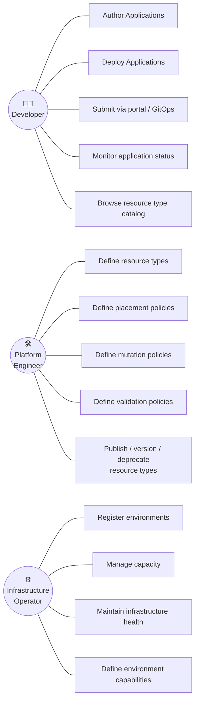

# DCM Personas Design Document

**Status:** Draft
**Date:** 2026-04-23
**Authors:** DCM Team

---

## 1. Overview

DCM has three distinct personas, each with a clear separation of concerns. This separation ensures that developers focus on application logic, platform engineers define the abstractions and policies, and infrastructure operators manage the physical and virtual environments.

---

## 2. Developer

### 2.1 Role

The developer builds and ships applications. They care about what their application needs — a database, a container, a load balancer — but not about how or where those resources are provisioned.

### 2.2 Responsibilities

- **Author Applications.** Write `Application` YAML specs that declare the resources an application needs, using predefined resource types.
- **Deploy Applications.** Submit Applications for provisioning through the available interfaces.
- **Submit via self-service portal or GitOps.** Push Applications to Git (for gitops) or submit them through the self-service portal UI.
- **Monitor application status.** View the provisioning status and health of their Application and its resources.
- **Browse resource type catalog.** Discover available resource types, their properties, and output schemas.

### 2.3 What developers do NOT do

- Define or modify resource types — they consume what platform engineers provide.
- Choose environments or datacenters — placement is handled by platform policy.
- Manage infrastructure lifecycle — that is the infrastructure operator's domain.
- Configure provisioners, drivers, or low-level infrastructure details.

### 2.4 Interface

| Interface | Description |
|-----------|-------------|
| `Application` YAML | The primary artifact. Developers write and maintain these. |
| Self-service portal | UI for browsing resource types, submitting Applications, and monitoring status. |
| GitOps | Git-based workflow for version-controlled Application management. |
| Resource type catalog | Read-only view of available resource types, their properties, and output schemas. |

## 3. Platform Engineer

### 3.1 Role

The platform engineer defines the building blocks that developers consume. They create resource type abstractions, set policies for how Applications are placed across environments, and can mutate or constrain developer requests to enforce organizational standards.

### 3.2 Responsibilities

- **Define resource types.** Create and maintain resource type definitions that abstract infrastructure primitives. Each resource type has:
  - An input schema (what properties developers can set).
  - An output schema (what values are exposed to other resources via CEL).
  - A binding to a provisioner (how the resource is actually created).
- **Define placement policies.** Write rules that determine which environment an Application is deployed to, based on labels, team, criticality, cost, capacity, or other criteria.
- **Define mutation policies.** Write rules that modify or augment developer requests. For example:
  - Enforce minimum resource sizes for production workloads.
  - Inject sidecar resources (monitoring, security agents) automatically.
  - Override properties based on organizational standards.
- **Define validation policies.** Write rules that reject Applications that don't meet organizational requirements (e.g., production databases must have `multiAZ: true`).
- **Publish / version / deprecate resource types.** Manage the resource type catalog lifecycle. Ensure developers have clear documentation on available types and their schemas.

### 3.3 What platform engineers do NOT do

- Deploy individual applications — that is the developer's responsibility.
- Manage physical infrastructure, capacity, or environment health — that is the infrastructure operator's domain.

### 3.4 Interface

| Interface | Description |
|-----------|-------------|
| Resource type definitions | YAML specs that define resource types with input/output schemas and provisioner bindings. |
| Placement policies | Rules that map Applications to environments based on criteria like cost, team, and labels. |
| Mutation policies | Rules that modify Application requests (inject defaults, enforce standards, add sidecar resources). |
| Validation policies | Rules that reject non-compliant Applications at compile time. |

## 4. Infrastructure Operator

### 4.1 Role

The infrastructure operator manages the environments that Applications run on. They are responsible for the physical and virtual infrastructure — servers, networks, clusters, storage systems — and ensure that environments have sufficient capacity, are healthy, and meet SLAs.

### 4.2 Responsibilities

- **Register environments.** Define the environments (datacenters, clusters, cloud regions) where Applications can be deployed. Each environment has capacity, capabilities, and health status.
- **Manage capacity.** Monitor resource utilization across environments. Add capacity (provision new servers, expand clusters) or decommission aging infrastructure.
- **Maintain infrastructure health.** Monitor environment health, respond to hardware failures, perform maintenance (firmware updates, OS patching, network changes).
- **Define environment capabilities.** Tag environments with capabilities (e.g., GPU-enabled, high-memory, compliance-certified) so that placement policies can make informed decisions.

### 4.3 What infrastructure operators do NOT do

- Define resource types or application abstractions — that is the platform engineer's domain.
- Write or deploy Applications — that is the developer's domain.
- Set placement or mutation policies — that is the platform engineer's domain.

### 4.4 Interface

| Interface | Description |
|-----------|-------------|
| Environment definitions | Register and configure environments with capacity, capabilities, and status. |
| Capacity dashboard | Monitor utilization and available capacity across all environments. |
| Maintenance workflows | Schedule and execute infrastructure maintenance with automated drain and migration. |
| Alerting and monitoring | Receive alerts on infrastructure health, capacity thresholds, and hardware failures. |
