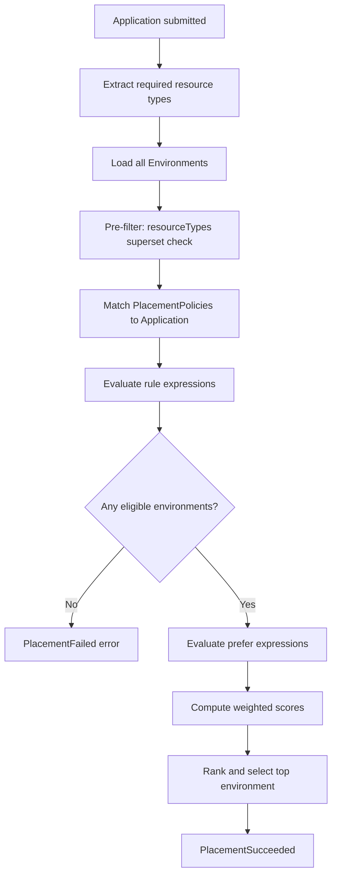

# DCM Placement Design Document

**Status:** Draft
**Date:** 2026-04-27
**Authors:** DCM Team

---

## 1. Overview

Placement is the process of selecting an Environment for an Application's resources. When the Execution Engine processes an Application, it evaluates placement policies to determine which registered Environment should host the workload. Platform Engineers author PlacementPolicy resources; Developers never choose environments directly.

### 1.1 Design Principles

1. **Policy-driven.** Platform Engineers express placement intent as declarative PlacementPolicy resources. No imperative scheduling logic.

2. **CEL-based.** All constraints and preferences use [Common Expression Language (CEL)](https://cel.dev/) for flexibility and type safety.

3. **Transparent.** Every placement decision is auditable. Operators can query why an environment was chosen or rejected.

4. **Composable.** Multiple policies combine predictably: rules are ANDed, preferences are summed with weights.

---

## 2. PlacementPolicy Resource

```yaml
apiVersion: dcm.io/v1alpha1
kind: PlacementPolicy
metadata:
  name: gdpr-compliance
  labels:
    scope: regulatory
spec:
  match:
    labels:
      compliance: gdpr
    resourceTypes:
      - database.postgresql
  rule: >-
    env.sovereignty.jurisdiction == "EU"
    && env.sovereignty.compliance.exists(c, c == "GDPR")
    && env.status.staleness == "fresh"
  prefer: >-
    env.capacity.cpu.available
  weight: 1.0
  priority: 100
```

### 2.1 Field Reference

| Field | Required | Type | Default | Description |
|-------|----------|------|---------|-------------|
| `apiVersion` | Yes | string | -- | API version. Currently `dcm.io/v1alpha1`. |
| `kind` | Yes | string | -- | Always `PlacementPolicy`. |
| `metadata.name` | Yes | string | -- | Unique policy name. |
| `metadata.labels` | No | map&lt;string, string&gt; | -- | Labels for organizing policies. |
| `spec.match` | Yes | MatchCriteria | -- | Selects which Applications this policy applies to. |
| `spec.rule` | No | string (CEL) | -- | Hard constraint. Must evaluate to `true` for an environment to be eligible. |
| `spec.prefer` | No | string (CEL) | -- | Soft preference. Evaluates to a numeric score; higher is better. |
| `spec.weight` | No | float | `1.0` | Multiplier for this policy's prefer score when combining with other policies. |
| `spec.priority` | No | int | `0` | Higher-priority policies are evaluated first. Used for evaluation ordering. |

### 2.2 Match Criteria

The `spec.match` block determines which Applications a policy applies to. An Application matches if it satisfies **all** specified criteria.

| Field | Required | Type | Description |
|-------|----------|------|-------------|
| `match.labels` | No | map&lt;string, string&gt; | Application must have all these labels. |
| `match.resourceTypes` | No | list&lt;string&gt; | Policy applies when the Application requires any of these resource types. |
| `match.all` | No | bool | If `true`, policy matches all Applications. |

At least one match criterion must be specified, or `match.all: true` must be set.

---

## 4. Evaluation Flow

When an Application is submitted, the Execution Engine runs the following placement pipeline:



### 4.1 Steps

1. **Application submitted.** An Application is created or updated via GitOps or the self-service portal.

2. **Extract resource types.** Collect the unique set of resource types from `app.spec.resources[*].type`.

3. **Load candidate environments.** All registered Environments are loaded from the Environment store.

4. **Pre-filter by resource types.** Discard any environment whose `capabilities.resourceTypes` is not a superset of the required resource types. This is a built-in hard constraint that always applies, regardless of policies.

5. **Match policies.** Find all PlacementPolicy resources whose `spec.match` criteria match the Application. Policies with `spec.match.all: true` always match.

6. **Evaluate hard constraints (`rule`).** For each candidate environment, evaluate every matching policy's `rule` expression. All rules must return `true` (AND semantics). If any rule returns `false`, the environment is eliminated.

7. **Evaluate soft preferences (`prefer`).** For each surviving environment, evaluate every matching policy's `prefer` expression. Each returns a numeric score.

8. **Compute weighted score.** For each environment:

   ```
   finalScore = SUM( policy[i].prefer_score * policy[i].weight )
   ```

9. **Rank and select.** Sort environments by `finalScore` descending. Select the top-ranked environment.

10. **Tie-breaking.** If multiple environments share the same score, ties are broken by environment name (alphabetical, deterministic).

11. **No eligible environment.** If no environment passes all rules, the placement fails with an error listing which rules eliminated which environments.

---

## 5. Policy Composition

### 5.1 Rule Composition (AND)

All matching policies' `rule` expressions are logically ANDed. An environment must satisfy **every** rule from **every** matching policy.

```
eligible = rule_policy_1(env) AND rule_policy_2(env) AND ... AND rule_policy_n(env)
```

### 5.2 Preference Composition (Weighted Sum)

Each policy's `prefer` score is multiplied by its `weight` and summed across all matching policies:

```
finalScore = (prefer_1 * weight_1) + (prefer_2 * weight_2) + ... + (prefer_n * weight_n)
```

This allows some preferences to matter more than others. For example, a cost policy with `weight: 2.0` will have twice the influence of a capacity policy with `weight: 1.0`.

### 5.3 Priority

The `priority` field controls evaluation order. Higher-priority policies are evaluated first, allowing short-circuit on rule failures. This is primarily an optimization -- since rules are ANDed, the logical result is the same regardless of order, but early elimination avoids unnecessary CEL evaluation.

### 5.4 Default Policy

A policy with `spec.match.all: true` and low priority serves as a fallback. It applies to all Applications and provides a baseline preference when no other policies match.

```yaml
apiVersion: dcm.io/v1alpha1
kind: PlacementPolicy
metadata:
  name: default-prefer-capacity
spec:
  match:
    all: true
  rule: >-
    env.status.staleness == "fresh"
  prefer: >-
    env.capacity.cpu.available
  weight: 0.5
  priority: 0
```

---

## 6. Placement Scope

### 6.1 Application-Level Placement (Default)

By default, all resources in an Application are placed in the same environment. This simplifies networking between resources and ensures cross-resource CEL references resolve within a single environment.

When all resources share the same placement requirements, single-environment placement is the simplest and most reliable approach.

### 6.2 Per-Resource Placement (Multi-Environment)

Individual resources can declare placement hints that direct them to different environments. This enables scenarios such as placing a database in the EU for GDPR compliance while keeping compute close to US users.

When resources are split across environments, the placement engine validates cross-environment connectivity to ensure the application still works. For the full design of per-resource placement, connectivity validation, overlay networks, and native peering, see [multi-env.md](multi-env.md).

### 6.3 When Placement Happens

Placement is evaluated when:
- An Application is **first created**.
- An Application's **resource types change** (a resource is added or removed that alters the required set).
- A Platform Engineer or Operator **explicitly triggers re-placement**.

Placement is **not** re-evaluated on every Application update (e.g., changing a property value).

### 6.4 Sticky Placement

Once an Application is placed, it remains in the chosen environment(s) unless explicitly re-placed. This prevents disruptive migrations caused by shifting capacity or cost metrics. Re-placement can be triggered by:
- Operator command (e.g., during decommissioning).
- Policy annotation requesting periodic re-evaluation.

---

## 7. Built-in CEL Functions

The placement engine provides helper functions in addition to the standard CEL library.

| Function | Signature | Description |
|----------|-----------|-------------|
| `hasFeature` | `(env, string) -> bool` | Returns `true` if the environment has the given feature. Shorthand for `env.capabilities.features.exists(f, f == feature)`. |
| `hasCompliance` | `(env, string) -> bool` | Returns `true` if the environment holds the given compliance certification. Shorthand for `env.sovereignty.compliance.exists(c, c == standard)`. |
| `capacityPercent` | `(CapacityDimension) -> double` | Returns `(available / total) * 100.0`. Useful for comparing relative capacity across environments of different sizes. |

### 7.1 Usage

```cel
# Using built-in functions
hasFeature(env, "gpu") && hasCompliance(env, "GDPR")

# Prefer environments with most relative CPU headroom
capacityPercent(env.capacity.cpu)
```

---

## 8. Examples

### 8.1 GDPR Compliance Routing

Route applications labeled with `compliance: gdpr` to EU environments with GDPR certification.

```yaml
apiVersion: dcm.io/v1alpha1
kind: PlacementPolicy
metadata:
  name: gdpr-routing
spec:
  match:
    labels:
      compliance: gdpr
  rule: >-
    env.sovereignty.jurisdiction == "EU"
    && hasCompliance(env, "GDPR")
    && env.sovereignty.dataClassification in ["confidential", "restricted"]
  prefer: >-
    env.capacity.memory.available
```

### 8.2 Cost Optimization

Prefer the cheapest environment. Since `prefer` selects higher scores, use negative cost values.

```yaml
apiVersion: dcm.io/v1alpha1
kind: PlacementPolicy
metadata:
  name: cost-optimized
spec:
  match:
    labels:
      cost-profile: optimize
  rule: >-
    env.status.staleness == "fresh"
    && env.capacity.cpu.available > 4
  prefer: >-
    -(env.cost.rates.cpu.value * 100.0 + env.cost.rates.memory.value * 256.0)
```

### 8.3 Capacity-Based

Prefer the environment with the most available CPU.

```yaml
apiVersion: dcm.io/v1alpha1
kind: PlacementPolicy
metadata:
  name: prefer-capacity
spec:
  match:
    all: true
  prefer: >-
    env.capacity.cpu.available
  weight: 0.5
  priority: 0
```

### 8.4 GPU Workloads

Require GPU-enabled environments for applications that use GPU resource types.

```yaml
apiVersion: dcm.io/v1alpha1
kind: PlacementPolicy
metadata:
  name: gpu-required
spec:
  match:
    labels:
      workload: gpu
  rule: >-
    hasFeature(env, "gpu")
    && env.capacity.gpu.available > 0
  prefer: >-
    env.capacity.gpu.available
```

### 8.5 Team-Based Routing

Route a team's workloads to environments labeled for that team.

```yaml
apiVersion: dcm.io/v1alpha1
kind: PlacementPolicy
metadata:
  name: team-data-routing
spec:
  match:
    labels:
      team: data-platform
  rule: >-
    env.metadata.labels["team"] == "data-platform"
    || env.metadata.labels["shared"] == "true"
  prefer: >-
    env.metadata.labels["team"] == "data-platform" ? 1000.0 : 0.0
```

### 8.6 Multi-Policy Composition

Two policies apply to the same application. The GDPR policy enforces a hard rule; the cost policy adds a weighted preference.

```yaml
# Policy 1: hard constraint on sovereignty
apiVersion: dcm.io/v1alpha1
kind: PlacementPolicy
metadata:
  name: eu-only
spec:
  match:
    labels:
      region: eu
  rule: >-
    env.sovereignty.jurisdiction == "EU"
  priority: 100
---
# Policy 2: soft preference for cost
apiVersion: dcm.io/v1alpha1
kind: PlacementPolicy
metadata:
  name: prefer-low-cost
spec:
  match:
    labels:
      region: eu
  prefer: >-
    -env.cost.rates.cpu.value
  weight: 2.0
  priority: 50
```

For an Application with label `region: eu`, both policies match. An environment must be in the EU (rule from policy 1). Among eligible environments, the one with the lowest CPU cost is preferred (policy 2, weight 2.0).

### 8.7 Default Fallback

A catch-all policy that applies when no other policies match.

```yaml
apiVersion: dcm.io/v1alpha1
kind: PlacementPolicy
metadata:
  name: default-fallback
spec:
  match:
    all: true
  rule: >-
    env.status.staleness == "fresh"
  prefer: >-
    capacityPercent(env.capacity.cpu)
  weight: 0.5
  priority: 0
```

---

## 9. Validation

The system validates PlacementPolicy resources at creation time.

| Check | Description |
|-------|-------------|
| **CEL syntax** | `rule` and `prefer` must parse as valid CEL expressions. |
| **Rule return type** | `rule` expression must return `bool`. |
| **Prefer return type** | `prefer` expression must return `int` or `double`. |
| **Weight range** | `weight` must be greater than `0.0`. |
| **Priority range** | `priority` must be `>= 0`. |
| **Match criteria** | At least one match criterion must be specified, or `match.all` must be `true`. |
| **Name uniqueness** | Policy name must be unique across all PlacementPolicy resources. |
| **CEL field references** | All `env.*` and `app.*` references must resolve to known fields. |

---

## 10. Observability

### 10.1 Placement Decision Log

Every placement decision is recorded with:

| Field | Description |
|-------|-------------|
| `timestamp` | When the placement decision was made. |
| `application` | Name of the Application. |
| `matchedPolicies` | List of PlacementPolicy names that matched. |
| `candidates` | Environments that passed pre-filtering, with their scores. |
| `eliminated` | Environments that were eliminated, with the rule that rejected them. |
| `selected` | The environment that was selected. |
| `finalScore` | The winning environment's computed score. |

### 10.2 Decision Query

Platform Engineers can query placement decisions:

```
dcm placement explain <application-name>
```

Returns the full evaluation trace: matched policies, candidate environments with individual and weighted scores, eliminated environments with rejection reasons, and the final selection.

### 10.3 Metrics

| Metric | Description |
|--------|-------------|
| `dcm_placement_duration_seconds` | Histogram of placement evaluation latency. |
| `dcm_placement_candidates_total` | Number of candidate environments per evaluation. |
| `dcm_placement_failures_total` | Counter of placement failures (no eligible environment). |
| `dcm_placement_policy_matches_total` | Counter of policy matches per policy name. |
| `dcm_placement_environment_selections_total` | Counter of selections per environment. |

### 10.4 Events

The system emits events on the Application resource:

| Event | Condition |
|-------|-----------|
| `PlacementSucceeded` | An environment was selected successfully. Includes environment name and score. |
| `PlacementFailed` | No eligible environment found. Includes rejection reasons. |
| `PlacementRetry` | Placement is being retried after a transient failure. |

---

## 11. Glossary

| Term | Definition |
|------|------------|
| **Placement** | The process of selecting an Environment for an Application's resources based on policies. |
| **PlacementPolicy** | A declarative resource defining hard constraints (rules) and soft preferences for environment selection. |
| **Rule** | A CEL expression that must evaluate to `true` for an environment to be eligible. Hard constraint. |
| **Prefer** | A CEL expression that returns a numeric score for ranking eligible environments. Soft preference. |
| **Weight** | A multiplier applied to a policy's prefer score when combining with other policies. |
| **Priority** | An integer controlling policy evaluation order. |
| **Pre-filter** | The built-in step that eliminates environments lacking required resource types before policy evaluation. |
| **Sticky Placement** | The behavior where an Application remains in its chosen environment unless explicitly re-placed. |
| **Placement Decision Log** | An audit record of every placement evaluation, including scores, eliminations, and the final selection. |
