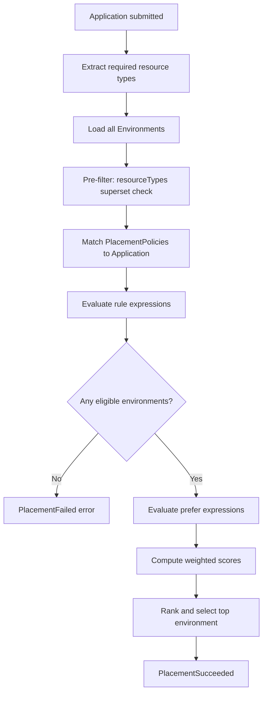

# DCM Placement Design Document

**Status:** Draft
**Date:** 2026-04-27
**Authors:** DCM Team

---

## 1. Overview

Placement is the process of selecting an Environment for an Application's resources. When the Execution Engine processes an Application, it evaluates placement policies to determine which registered Environment should host the workload. Platform Engineers author PlacementPolicy resources; Developers never choose environments directly.

### 1.1 Design Principles

1. **Policy-driven.** Platform Engineers express placement intent as declarative PlacementPolicy resources. No imperative scheduling logic.

2. **CEL-based.** All constraints and preferences use [Common Expression Language (CEL)](https://cel.dev/) for flexibility and type safety.

3. **Transparent.** Every placement decision is auditable. Operators can query why an environment was chosen or rejected.

4. **Composable.** Multiple policies combine predictably: rules are ANDed, preferences are summed with weights.

---

## 2. PlacementPolicy Resource

```yaml
apiVersion: dcm.io/v1alpha1
kind: PlacementPolicy
metadata:
  name: gdpr-compliance
  labels:
    scope: regulatory
spec:
  match:
    labels:
      compliance: gdpr
    resourceTypes:
      - database.postgresql
  rule: >-
    env.sovereignty.jurisdiction == "EU"
    && env.sovereignty.compliance.exists(c, c == "GDPR")
    && env.status.staleness == "fresh"
  prefer: >-
    env.capacity.cpu.available
  weight: 1.0
  priority: 100
```

### 2.1 Field Reference

| Field | Required | Type | Default | Description |
|-------|----------|------|---------|-------------|
| `apiVersion` | Yes | string | -- | API version. Currently `dcm.io/v1alpha1`. |
| `kind` | Yes | string | -- | Always `PlacementPolicy`. |
| `metadata.name` | Yes | string | -- | Unique policy name. |
| `metadata.labels` | No | map&lt;string, string&gt; | -- | Labels for organizing policies. |
| `spec.match` | Yes | MatchCriteria | -- | Selects which Applications this policy applies to. |
| `spec.rule` | No | string (CEL) | -- | Hard constraint. Must evaluate to `true` for an environment to be eligible. |
| `spec.prefer` | No | string (CEL) | -- | Soft preference. Evaluates to a numeric score; higher is better. |
| `spec.weight` | No | float | `1.0` | Multiplier for this policy's prefer score when combining with other policies. |
| `spec.priority` | No | int | `0` | Higher-priority policies are evaluated first. Used for evaluation ordering. |

### 2.2 Match Criteria

The `spec.match` block determines which Applications a policy applies to. An Application matches if it satisfies **all** specified criteria.

| Field | Required | Type | Description |
|-------|----------|------|-------------|
| `match.labels` | No | map&lt;string, string&gt; | Application must have all these labels. |
| `match.resourceTypes` | No | list&lt;string&gt; | Policy applies when the Application requires any of these resource types. |
| `match.all` | No | bool | If `true`, policy matches all Applications. |

At least one match criterion must be specified, or `match.all: true` must be set.

---

## 3. Evaluation Flow

When an Application is submitted, the Execution Engine runs the following placement pipeline:



### 3.1 Steps

1. **Application submitted.** An Application is created or updated via GitOps or the self-service portal.

2. **Extract resource types.** Collect the unique set of resource types from `app.spec.resources[*].type`.

3. **Load candidate environments.** All registered Environments are loaded from the Environment store.

4. **Pre-filter by resource types.** Discard any environment whose `capabilities.resourceTypes` is not a superset of the required resource types. This is a built-in hard constraint that always applies, regardless of policies.

5. **Match policies.** Find all PlacementPolicy resources whose `spec.match` criteria match the Application. Policies with `spec.match.all: true` always match.

6. **Evaluate hard constraints (`rule`).** For each candidate environment, evaluate every matching policy's `rule` expression. All rules must return `true` (AND semantics). If any rule returns `false`, the environment is eliminated.

7. **Evaluate soft preferences (`prefer`).** For each surviving environment, evaluate every matching policy's `prefer` expression. Each returns a numeric score.

8. **Compute weighted score.** For each environment:

   ```
   finalScore = SUM( policy[i].prefer_score * policy[i].weight )
   ```

9. **Rank and select.** Sort environments by `finalScore` descending. Select the top-ranked environment.

10. **Tie-breaking.** If multiple environments share the same score, ties are broken by environment name (alphabetical, deterministic).

11. **No eligible environment.** If no environment passes all rules, the placement fails with an error listing which rules eliminated which environments.

---

## 4. Policy Composition

### 4.1 Rule Composition (AND)

All matching policies' `rule` expressions are logically ANDed. An environment must satisfy **every** rule from **every** matching policy.

```
eligible = rule_policy_1(env) AND rule_policy_2(env) AND ... AND rule_policy_n(env)
```

### 4.2 Preference Composition (Weighted Sum)

Each policy's `prefer` score is multiplied by its `weight` and summed across all matching policies:

```
finalScore = (prefer_1 * weight_1) + (prefer_2 * weight_2) + ... + (prefer_n * weight_n)
```

This allows some preferences to matter more than others. For example, a cost policy with `weight: 2.0` will have twice the influence of a capacity policy with `weight: 1.0`.

### 4.3 Priority

The `priority` field controls evaluation order. Higher-priority policies are evaluated first, allowing short-circuit on rule failures. This is primarily an optimization -- since rules are ANDed, the logical result is the same regardless of order, but early elimination avoids unnecessary CEL evaluation.

### 4.4 Default Policy

A policy with `spec.match.all: true` and low priority serves as a fallback. It applies to all Applications and provides a baseline preference when no other policies match.

```yaml
apiVersion: dcm.io/v1alpha1
kind: PlacementPolicy
metadata:
  name: default-prefer-capacity
spec:
  match:
    all: true
  rule: >-
    env.status.staleness == "fresh"
  prefer: >-
    env.capacity.cpu.available
  weight: 0.5
  priority: 0
```
---

## 5. Glossary

| Term | Definition |
|------|------------|
| **Placement** | The process of selecting an Environment for an Application's resources based on policies. |
| **PlacementPolicy** | A declarative resource defining hard constraints (rules) and soft preferences for environment selection. |
| **Rule** | A CEL expression that must evaluate to `true` for an environment to be eligible. Hard constraint. |
| **Prefer** | A CEL expression that returns a numeric score for ranking eligible environments. Soft preference. |
| **Weight** | A multiplier applied to a policy's prefer score when combining with other policies. |
| **Priority** | An integer controlling policy evaluation order. |
| **Pre-filter** | The built-in step that eliminates environments lacking required resource types before policy evaluation. |
| **Sticky Placement** | The behavior where an Application remains in its chosen environment unless explicitly re-placed. |
| **Placement Decision Log** | An audit record of every placement evaluation, including scores, eliminations, and the final selection. |
